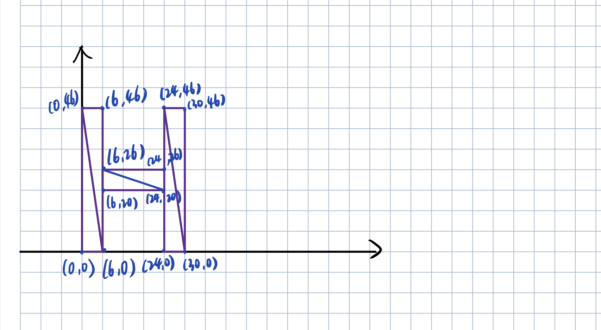
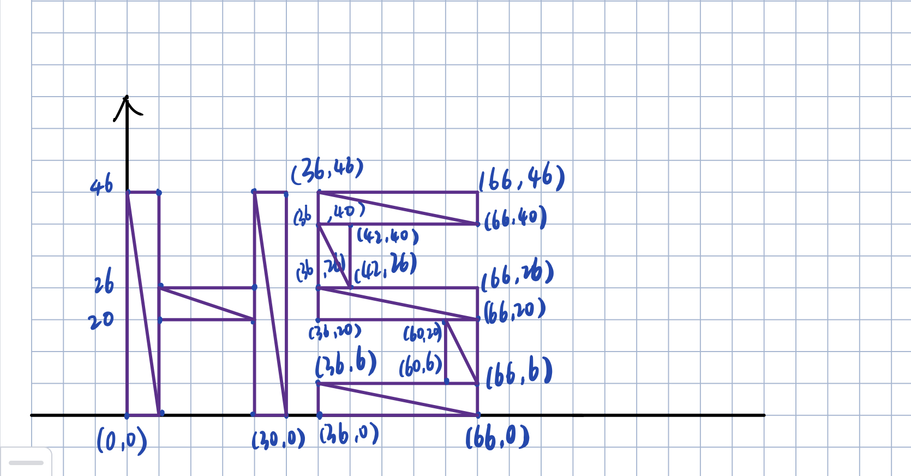
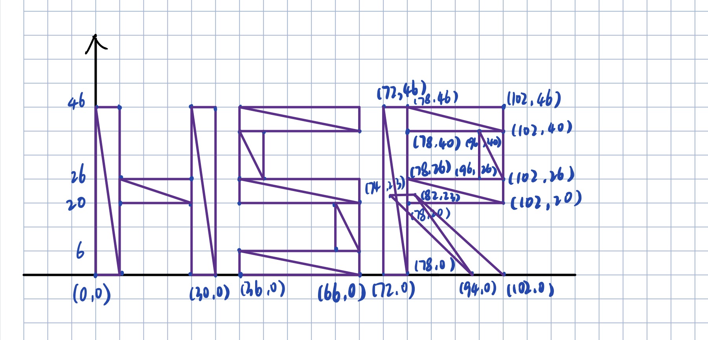
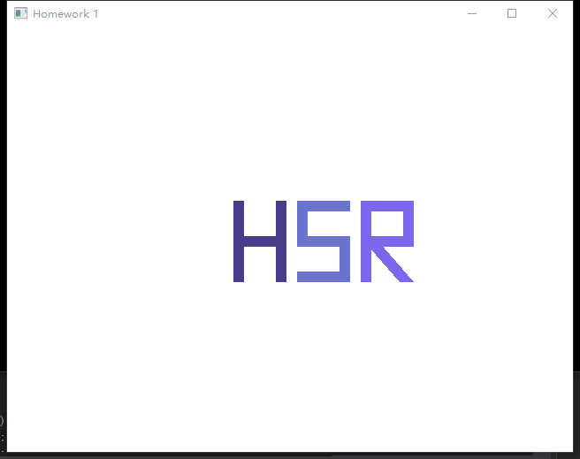

### 一、实验题目
绘制姓名首字母
### 二、实验要求
绘制姓名首字母，使用三角面片作为图元绘制姓名首字母，可使用的 OpenGL 图元类型包括： **GL_TRIANGLES、GL_TRIANGLE_STRIP 以及 GL_TRIANGLE_FAN**。例如：黄小明，名字首 字母为 HXM，因此需要绘制 HXM 三个字母，下图为 H 的 demo。
在书面报告中，需要明确说明每个字母所需的语句数（glBegin, glEnd, glVertex）的数量，循环调用的需要重复计算（即循环体内 glVertex 等需要乘循环次数）。请尽量精简你的实现！

注：为了公平性，每人需绘制三个不同的字母，即遵循以下三条规则: 

⚫ 名字大于三个字的只需绘制前三个字的首字母。（若此时有相同字母，见规则 3） 

⚫ 名字少于三个字的后面多加一个字母，此字母为第二个字母的后一个字母。如 HX， 则需绘制 HXY。（若此时有相同字母，见规则 3） 

⚫ 若有相同字母，则第二第三个相同字母依次往后推，如 $ AAA => ABB => ABC， ACC => ACD，AAB => ABB => ABC$  

### 三、实验过程
#### 1.配置环境
按照附件的配置过程配置实验环境，成功运行了附件的 demo 之后，理解了demo 的 "I" 是怎么绘制的。
#### 2.编写代码
本次实验要绘制的字母为 HSR 。
##### · 绘制H：
H 可以由三个矩形，六个三角形构成，字母粗度为 6 ，则 H 的各个顶点坐标如下：


用 GL_TRIANGLES 实现的话，需要**1个（glBegin+glEnd），18个glVertex**；

用 GL_TRIANGLE_STRIP 实现的话，需要**3个（glBegin+glEnd），12个glVertex**。

GL_TRIANGLES 实现代码:
```c++
    // draw H
	glBegin(GL_TRIANGLES);

	glVertex2f(0.0f, 0.0f);
	glVertex2f(6.0f, 0.0f);
	glVertex2f(0.0f, 46.0f);

	glVertex2f(6.0f, 0.0f);
	glVertex2f(0.0f, 46.0f);
	glVertex2f(6.0f, 46.0f);

	
	glVertex2f(6.0f, 20.0f);
	glVertex2f(6.0f, 26.0f);
	glVertex2f(24.0f, 20.0f);

	glVertex2f(24.0f, 20.0f);
	glVertex2f(6.0f, 26.0f);
	glVertex2f(24.0f, 26.0f);

	
	glVertex2f(24.0f, 0.0f);
	glVertex2f(30.0f, 0.0f);
	glVertex2f(24.0f, 46.0f);

	glVertex2f(30.0f, 0.0f);
	glVertex2f(24.0f, 46.0f);
	glVertex2f(30.0f, 46.0f);

	glEnd();
```

GL_TRIANGLE_STRI 实现代码：
```c++
	//draw H
	glShadeModel(GL_SMOOTH);
	glColor3f(0.2823f, 0.2392f, 0.5450f);

	glBegin(GL_TRIANGLE_STRIP);
	glVertex2f(0.0f, 0.0f);
	glVertex2f(6.0f, 0.0f);
	glVertex2f(0.0f, 46.0f);
	glVertex2f(6.0f, 46.0f);
	glEnd();
	
	glBegin(GL_TRIANGLE_STRIP);
	glVertex2f(6.0f, 20.0f);
	glVertex2f(6.0f, 26.0f);
	glVertex2f(24.0f, 20.0f);
	glVertex2f(24.0f, 26.0f);
	glEnd();
	
	glBegin(GL_TRIANGLE_STRIP);
	glVertex2f(24.0f, 0.0f);
	glVertex2f(30.0f, 0.0f);
	glVertex2f(24.0f, 46.0f);
	glVertex2f(30.0f, 46.0f);
	glEnd();
```

##### · 绘制S：
S 可以由五个矩形，十个三角形构成，字母粗度为 6 ，则 S 的各个顶点坐标如下：


用 GL_TRIANGLES 实现的话，需要**1个（glBegin+glEnd），30个glVertex**；

用 GL_TRIANGLE_STRIP 实现的话，需要**5个（glBegin+glEnd），20个glVertex**。

GL_TRIANGLES 实现代码:
```c++
	//draw S
    glColor3f(0.415f, 0.4529f, 0.803f);
	glBegin(GL_TRIANGLES);

	//draw -
	glVertex2f(36.0f, 0.0f);
	glVertex2f(36.0f, 6.0f);
	glVertex2f(66.0f, 0.0f);

	glVertex2f(66.0f, 6.0f);
	glVertex2f(36.0f, 6.0f);
	glVertex2f(66.0f, 0.0f);

	// |
	glVertex2f(36.0f, 26.0f);
	glVertex2f(42.0f, 26.0f);
	glVertex2f(36.0f, 40.0f);

	glVertex2f(42.0f, 26.0f);
	glVertex2f(42.0f, 40.0f);
	glVertex2f(36.0f, 40.0f);

	// -
	glVertex2f(36.0f, 20.0f);
	glVertex2f(36.0f, 26.0f);
	glVertex2f(66.0f, 20.0f);

	glVertex2f(66.0f, 20.0f);
	glVertex2f(36.0f, 26.0f);
	glVertex2f(66.0f, 26.0f);

	// |
	glVertex2f(60.0f, 6.0f);
	glVertex2f(66.0f, 6.0f);
	glVertex2f(60.0f, 20.0f);

	glVertex2f(60.0f, 20.0f);
	glVertex2f(66.0f, 20.0f);
	glVertex2f(66.0f, 6.0f);

	// -
	glVertex2f(36.0f, 40.0f);
	glVertex2f(36.0f, 46.0f);
	glVertex2f(66.0f, 40.0f);

	glVertex2f(66.0f, 40.0f);
	glVertex2f(36.0f, 46.0f);
	glVertex2f(66.0f, 46.0f);

	glEnd();
```

GL_TRIANGLE_STRI 实现代码：
```c++
	//draw S
	glColor3f(0.415f, 0.4529f, 0.803f);
	//draw -
	glBegin(GL_TRIANGLE_STRIP);
	glVertex2f(36.0f, 0.0f);
	glVertex2f(36.0f, 6.0f);
	glVertex2f(66.0f, 0.0f);
	glVertex2f(66.0f, 6.0f);
	glEnd();

	// |
	glBegin(GL_TRIANGLE_STRIP);
	glVertex2f(36.0f, 26.0f);
	glVertex2f(42.0f, 26.0f);
	glVertex2f(36.0f, 40.0f);
	glVertex2f(42.0f, 40.0f);
	glEnd();

	// -
	glBegin(GL_TRIANGLE_STRIP);
	glVertex2f(36.0f, 20.0f);
	glVertex2f(36.0f, 26.0f);
	glVertex2f(66.0f, 20.0f);
	glVertex2f(66.0f, 26.0f);
	glEnd();

	// |
	glBegin(GL_TRIANGLE_STRIP);
	glVertex2f(60.0f, 6.0f);
	glVertex2f(66.0f, 6.0f);
	glVertex2f(60.0f, 20.0f);
	glVertex2f(66.0f, 20.0f);
	glEnd();


	// -
	glBegin(GL_TRIANGLE_STRIP);
	glVertex2f(36.0f, 40.0f);
	glVertex2f(36.0f, 46.0f);
	glVertex2f(66.0f, 40.0f);
	glVertex2f(66.0f, 46.0f);
	glEnd();
```

##### · 绘制R：
R 可以由五个矩形，十个三角形构成，字母粗度为 6 ，则 R 的各个顶点坐标如下：


用 GL_TRIANGLES 实现的话，需要**1个（glBegin+glEnd），30个glVertex**；

用 L_TRIANGLE_STRIP 实现的话，需要**5个（glBegin+glEnd），20个glVertex**。

GL_TRIANGLES 实现代码:
```C++
	//draw R
	glBegin(GL_TRIANGLES);
	glColor3f(0.482f, 0.407f, 0.933f);
	glVertex2f(72.0f, 0.0f);
	glVertex2f(78.0f, 0.0f);
	glVertex2f(72.0f, 46.0f);

	glVertex2f(72.0f, 46.0f);
	glVertex2f(78.0f, 0.0f);
	glVertex2f(78.0f, 46.0f);


	glVertex2f(102.0f, 40.0f);
	glVertex2f(102.0f, 46.0f);
	glVertex2f(78.0f, 46.0f);

	glVertex2f(102.0f, 40.0f);
	glVertex2f(78.0f, 40.0f);
	glVertex2f(78.0f, 46.0f);


	glVertex2f(102.0f, 40.0f);
	glVertex2f(102.0f, 26.0f);
	glVertex2f(96.0f, 40.0f);

	glVertex2f(96.0f, 26.0f);
	glVertex2f(102.0f, 26.0f);
	glVertex2f(96.0f, 40.0f);


	glVertex2f(82.0f, 23.0f);
	glVertex2f(102.0f, 0.0f);
	glVertex2f(94.0f, 0.0f);

	glVertex2f(94.0f, 0.0f);
	glVertex2f(74.0f, 23.0f);
	glVertex2f(82.0f, 23.0f);


	glVertex2f(102.0f, 20.0f);
	glVertex2f(102.0f, 26.0f);
	glVertex2f(78.0f, 26.0f);

	glVertex2f(102.0f, 20.0f);
	glVertex2f(78.0f, 20.0f);
	glVertex2f(78.0f, 26.0f);

	glEnd();
```

GL_TRIANGLE_STRI 实现代码：
```C++
	//draw R
	glColor3f(0.482f, 0.407f, 0.933f);

	// |
	glBegin(GL_TRIANGLE_STRIP);
	glVertex2f(72.0f, 0.0f);
	glVertex2f(78.0f, 0.0f);
	glVertex2f(72.0f, 46.0f);
	glVertex2f(78.0f, 46.0f);
	glEnd();

	// -
	glBegin(GL_TRIANGLE_STRIP);
	glVertex2f(102.0f, 46.0f);
	glVertex2f(102.0f, 40.0f);
	glVertex2f(78.0f, 46.0f);
	glVertex2f(78.0f, 40.0f);
	glEnd();

	// |
	glBegin(GL_TRIANGLE_STRIP);
	glVertex2f(102.0f, 40.0f);
	glVertex2f(102.0f, 26.0f);
	glVertex2f(96.0f, 40.0f);
	glVertex2f(96.0f, 26.0f);
	glEnd();

	// "\"
	glBegin(GL_TRIANGLE_STRIP);
	glVertex2f(74.0f, 23.0f);
	glVertex2f(94.0f, 0.0f);
	glVertex2f(82.0f, 23.0f);
	glVertex2f(102.0f, 0.0f);
	glEnd();

	// -
	glBegin(GL_TRIANGLE_STRIP);
	glVertex2f(102.0f, 26.0f);
	glVertex2f(102.0f, 20.0f);
	glVertex2f(78.0f, 26.0f);
	glVertex2f(78.0f, 20.0f);
	glEnd();
```

#### 3. 完善代码
· 将默认场景改为 scene_1() ,只需要将 myglwidget 的输出和按键功能场景 0 和 1 的 id 互换就可以：
原代码：
```C++
void MyGLWidget::paintGL()
{
	if (scene_id==0) {
		scene_0();
	}
	else {
		scene_1();
	}
}

void MyGLWidget::keyPressEvent(QKeyEvent *e) {
	//Press 0 or 1 to switch the scene
	if (e->key() == Qt::Key_0) {
		scene_id = 0;
		update();
	}
	else if (e->key() == Qt::Key_1) {
		scene_id = 1;
		update();
	}
}
```

更改后的代码:
```C++
void MyGLWidget::paintGL()
{
	if (scene_id==0) {
		scene_1();
	}
	else {
		scene_0();
	}
}

void MyGLWidget::keyPressEvent(QKeyEvent *e) {
	//Press 0 or 1 to switch the scene
	if (e->key() == Qt::Key_0) {
		scene_id = 1;
		update();
	}
	else if (e->key() == Qt::Key_1) {
		scene_id = 0;
		update();
	}
}
```

· 修改字母显示的位置和大小以及颜色
```C++
glOrtho(0.0f, 0.5*width(), 0.0f,0.5*height(), -1000.0f, 1000.0f);
glTranslatef(0.2 * width(), 0.2 * height(), 0.0f);

// H 的颜色
glColor3f(0.2823f, 0.2392f, 0.5450f);

// S 的颜色
glColor3f(0.415f, 0.4529f, 0.803f);

// R 的颜色
glColor3f(0.482f, 0.407f, 0.933f);
```
### 四、实验结果
编译运行后呈现如下效果：


### 五、实验感想
1. 按照附件的文档配置，一开始都挺顺利，结果在最后运行程序的时候报错找不到库文件，解决办法：右键属性选择链接器的常规，附加库目录添加库文件路径。
3. 一开始全用的 **GL_TRIANGLES** 顶点太多了，感觉好麻烦，用了 **GL_TRIANGLE_STRIP** 觉得稍微精简了一些。附件的 CGTemplate1 是用 GL_TRIANGLES 实现，CGTemplate1 是用 GL_TRIANGLE_STRIP 实现。