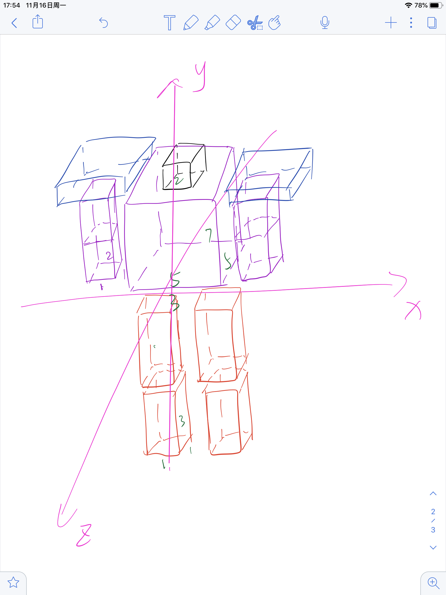
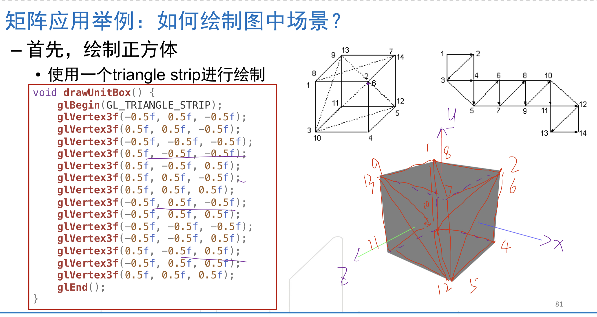
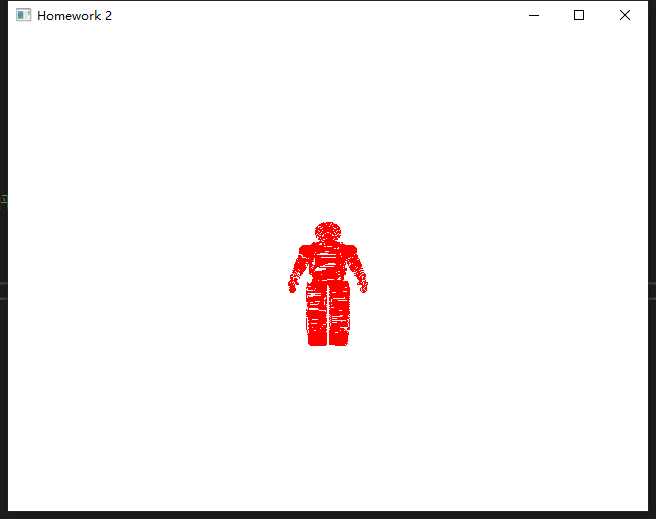
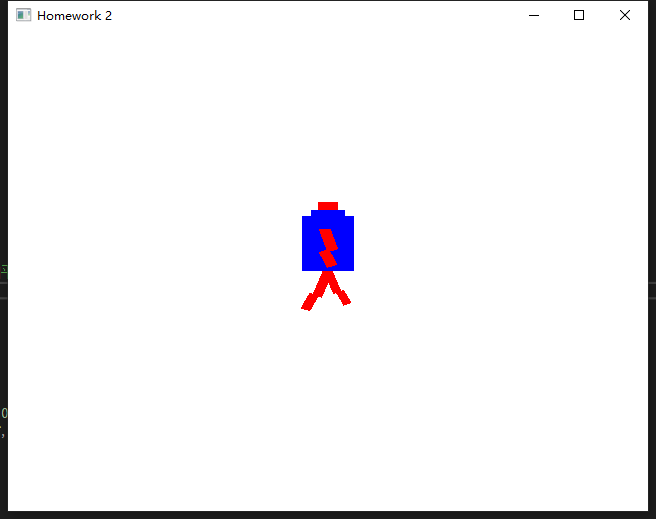
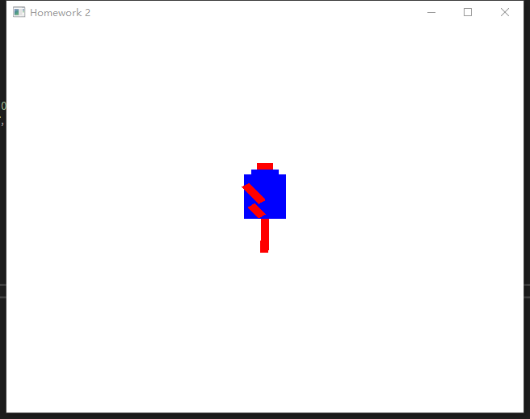

### 一、实验题目
绘制一个沿固定线路运动的机器人
### 二、实验要求

##### 	必要：

(a) 线路可以是圆或任意其它闭合路径

(b) 机器人在任意时刻应面向运动曲线的切线方向

(c) 机器人应该有头、躯干、四肢等基本部分

(d) 机器人在运动过程中应具有摆臂及抬脚两个基本动作

##### 	可选：

(e) 使用 mesh 模型 (如 obj 文件) 载入机器人模型

(f) 或载入其他 mesh 模型围绕机器人运动 

### 三、实验过程
#### 1. 理论知识
##### (1) QGLWidget 的一些相关知识
+ 参考链接 <http://shouce.jb51.net/qt-beginning/53.html>

参考上面的文档之后，我们知道 `QGLWidget` 提供了三个虚函数：
+ `initializeGL()`：设置 OpenGL 渲染环境，定义显示列表等。该函数只在第一次调用 `resizeGL()` 或 `paintGL()` 前被调用一次；
+ `resizeGL()`：设置 OpenGL 的视口、投影等。每次部件改变大小时都会调用该函数；
+ `paintGL()`：渲染 OpenGL 场景。每当部件需要更新时都会调用该函数。

所以在提供的模板中，所有要初始化的变量写在`initializeGL()`里面，在`paintGL()`函数中绘制，为了显示出动态效果，在这个函数里的绘制相当于是一帧一帧的绘制。

##### (2) 机器人的绘制原理
下面是我在草稿纸起草的准备绘制的机器人样子:
<center>

</center>

画出来可以比较方便的定机器人的坐标，图上所标的是每个部件的大概长宽高，具体在实现中有调整。另外这里 z 坐标是从屏幕内指向外。
在这一部分的绘制中，不必考虑物体的世界坐标，因为现阶段是在物体坐标中绘制，改变的是 GL_MODELVIEW 矩阵， 应用**平移，旋转，缩放**等操作。在这里我物体坐标定的原点在机器人躯干的底面的正中间，所以机器人的每个部件的坐标，在这一步是相对这个原点定的，每个部件基本只需要定 x，y 轴，因为物体的每个部件的中心始终在 z 轴的 0.

##### (3) 机器人的摆臂和沿闭合曲线运动原理
+ ###### 机器人的摆臂
在这里我需要摆的是下手臂和小腿。摆臂其实就是一个旋转操作，设置好旋转角度，然后递增/递减旋转角度，就可以实现摆臂的效果。这里关键是绕哪个点旋转和旋转轴。如果想要绕 (x,y,z) 轴旋转，在绘制某个部件之前，先平移(x,y,z),然后旋转，再平移回去(即平移 (-x,-y,-z) )，再绘制机器人。

**注意理解上面的步骤**: 因为在 opengl 中，`最后调用的最先应用`，关键是理解这句话，实际我们是先画了机器人，再把它平移，旋转，平移回去。但从编程的角度来说，实现的时候代码要以反过来的顺序实现！

造成要反过来的原因是因为，假设物体矩阵 v，下面的伪代码作用于物体 v:
```c++
glTranslate();      // 平移操作
glRotate();         // 旋转操作
v;                  // 物体 v                  
```

相当于矩阵乘法: $T*R*v = T*(R*v)$ ，所以对物体而言是先旋转再平移。即如果要对物体的操作是先选择再平移，编程实现的时候代码是先做平移操作再做旋转操作。 

+ ###### 沿闭合曲线运动
   
让整个机器人沿着 y 轴即可

##### (4) 机器人的显示原理
上一步相当于是摆放物体(坐标系变换从局部坐标到世界坐标)，这一步是摆放摄像机，观察物体(坐标变换从世界坐标到视点坐标)。初始的时候，即还没有坐标变换的时候，世界坐标，物体坐标，摄像机坐标(同视点坐标)，原点是重合的（即在屏幕中心），但单位长度不相同，世界坐标的范围是 [-1,1], 而其他两个的坐标单位长度没有意义，特别的，物体坐标和世界坐标的 x 轴是正方向水平向右， y 轴正方向是竖直向上， z 轴正方向是垂直屏幕，从屏幕里面指向外面，而视点坐标的 z 轴方向正好相反，和视线方向相反。

简单来说，在这一阶段就是调用 gluLookAt/glOrtho/gluPerspective，即在 GL_PROJECTION 矩阵上操作。

##### (5) obj 文件
+ 参考博客: [3D中OBJ文件格式详解](https://www.cnblogs.com/daofaziran/p/11540517.html)

obj 文件是 3D 模型文件格式，是一种文本文件，可以直接用写字板打开进行查看和编辑修改。虽然 obj 文件有很多关键字，但比较关键的是以下几个：
<table border="2">
    <tr>
        <td>关键字</td>
        <td>简短描述</td>
        <td>格式</td>
    </tr>
    <tr>
        <td>v</td>
        <td>几何体顶点 (Geometric vertices)</td>
        <td>v x y z</td>
    </tr>
        <tr>
        <td>vt</td>
        <td>贴图坐标点 (Texture vertices)</td>
        <td>vt x y z</td>
    </tr>
        <tr>
        <td>vn</td>
        <td>顶点法线 (Vertex normals)</td>
        <td>vn x y z</td>
    </tr>
        <tr>
        <td>g</td>
        <td>组名称 (Group name)</td>
        <td>g  GroupName</td>
    </tr>
        </tr>
        <tr>
        <td>f</td>
        <td>面</td>
        <td>f v1/vt1/vn1 v2/vt2/vn2 v3/vt3/vn3 <br/> f v1/vt1/vn1 v2/vt2/vn2 v3/vt3/vn3 v4/vt4/vn4</td>
    </tr>
</table>

其中，面的意思是，一个面有几个顶点(一般是三角形，多边形)， 然后就是 x/x/x 格式，x 都是索引，第一个 x 索引的是顶点 v, 第二个 x 索引的是纹理坐标 vt，第三个 x 索引的是法向量坐标 vn，法向量是为了指示面的方向。因为目前还没有学到关于纹理的知识，所以在具体实现的时候我只读了顶点坐标，法向量坐标和面。

#### 2. 编写代码
##### （1） 编写单位正方体
因为我的机器人的部件都可以是由正方体构成的，所以先封装一个绘制正方体的函数，代码实现使用了老师课件上的代码:
```c++
/*###################################################
##  函数: DrawCube
##  函数描述： 绘制单位正方体，中心在(0,0,0)
##  参数描述：
##   无
#####################################################*/
void DrawCube() {
	glBegin(GL_TRIANGLE_STRIP);
	glVertex3f(-0.5f, 0.5f, -0.5f);
	glVertex3f(0.5f, 0.5f, -0.5f);
	glVertex3f(-0.5f, -0.5f, -0.5f);
	glVertex3f(0.5f, -0.5f, -0.5f);
	glVertex3f(0.5f, -0.5f, 0.5f);
	glVertex3f(0.5f, 0.5f, -0.5f);
	glVertex3f(0.5f, 0.5f, 0.5f);
	glVertex3f(-0.5f, 0.5f, -0.5f);
	glVertex3f(-0.5f, 0.5f, 0.5f);
	glVertex3f(-0.5f, -0.5f, -0.5f);
	glVertex3f(-0.5f, -0.5f, 0.5f);
	glVertex3f(0.5f, -0.5f, 0.5f);
	glVertex3f(-0.5f, 0.5f, 0.5f);
	glVertex3f(0.5f, 0.5f, 0.5f);
	glEnd();
}
```

具体地，顶点绘制和连接如下图的正方体所示：

<center>

</center>

标号是对应上面代码的顶点顺序，原点在正方体中心。

##### （2） 封装绘制部件函数
因为每个部件其实就是相当于设置单位正方体的坐标，调整单位正方体的大小，是否要旋转，以及颜色设置，所以可以封装成一个函数，供每个部件绘制的时候调用:
```c++
/*###################################################
##  函数: DrawElement
##  函数描述： 绘制以单位正方体为基础部件的元素
##  参数描述：
##   tx,ty,tz: 物体相在物体坐标原点的位置
##   sx,sy,sz: 物体的长、宽、高
##   angle,rx,ry,rz: 物体的旋转角度和旋转轴
##   cx,cy,cz: 物体的颜色
#####################################################*/
void DrawElement(float tx,float ty,float tz,float sx,float sy,float sz,float angle,float rx,float ry,float rz,float cx,float cy,float cz) {
	glPushMatrix();
	glColor3f(cx, cy, cz);   
	glTranslatef(tx, ty, tz);
	glRotatef(angle, rx, ry, rz);
	glScalef(sx, sy, sz);   
	DrawCube();
	glPopMatrix();
}
```

注意上面的代码用了`glPushMatrix()`和`glPopMatrix()`,这样每个部件调用绘制了之后，又回到调用之前的矩阵，使得每个部件的绘制互不影响。

##### （3） 绘制机器人部件和摆臂
接下来绘制机器人的头，躯干，肩膀，手臂，腿只用调用上面封装的`DrawElement`函数即可，下面的代码中，每个部件的位置参数是按照上面的机器人示意图定的，size 的按个人喜好设置就好了。
```c++
	// 绘制body， 传入 位置坐标，      size 为 5*7*5       不旋转                    颜色为蓝色
	DrawElement(0.0f, 3.5f, 0.0f,    5.0f, 7.0f, 5.0f,   0.0f, 0.0f, 0.0f, 0.0f,   0.0f, 0.0f, 1.0f);

	// 绘制head  传入 位置坐标        size 为 2*2*2        不选择                    颜色为红色
	DrawElement(0.0f, 8.5f, 0.0f,    2.0f, 2.0f, 2.0f,   0.0f, 0.0f, 0.0f, 0.0f,   1.0f, 0.0f, 0.0f);

	// 绘制shoulder  传入位置坐标      size 为 2*2*3       不旋转                    颜色为蓝色
	DrawElement(-3.0f, 6.0f, 0.0f,   2.0f, 2.0f, 3.0f,   0.0f, 0.0f, 0.0f, 0.0f,   0.0f, 0.0f, 1.0f);		// 左肩膀
	DrawElement(3.0f, 6.0f, 0.0f,    2.0f, 2.0f, 3.0f,   0.0f, 0.0f, 0.0f, 0.0f,   0.0f, 0.0f, 1.0f);       // 右肩膀
	
	// 绘制左上臂	传入位置坐标       size 为 1*3*1       摆臂，绕 x 轴旋转 Arm°      颜色为红色
	DrawElement(-3.0f, 4.0f, 0.0f,   1.0f, 3.0f, 1.0f,   Arm,  1.0f, 0.0f, 0.0f,   1.0f, 0.0f, 0.0f);

	//  绘制左下臂  传入位置坐标       size 为 1*2*1       不旋转                  颜色为红色
	DrawElement(-3.0f, 1.5f, 0.0f,   1.0f, 2.0f, 1.0f,  0.0f, 0.0f, 0.0f, 0.0f,  1.0f, 0.0f, 0.0f);
		
	// 绘制右上臂   传入位置坐标       size 为 1*3*1       摆臂，绕 x 轴旋转 -Arm°      颜色为红色
	DrawElement(3.0f, 4.0f, 0.0f,    1.0f, 3.0f, 1.0f,  -Arm, 1.0f, 0.0f, 0.0f,   1.0f, 0.0f, 0.0f);

	//  绘制右下臂  传入位置坐标       size 为 1*2*1       不旋转                  颜色为红色
	DrawElement(3.0f, 1.5f, 0.0f,   1.0f, 2.0f, 1.0f,  0.0f, 0.0f, 0.0f, 0.0f,   1.0f, 0.0f, 0.0f);

	//   绘制左上腿  传入位置坐标       size 为 1*4*1       不旋转                  颜色为红色
	DrawElement(-1.5f, -1.5f, 0.0f,   1.0f, 4.0f, 1.0,   0.0f, 0.0f, 0.0f, 0.0f, 1.0f, 0.0f, 0.0f);	

	//  绘制左下腿    传入位置坐标       size 为 1*2*1       不旋转                  颜色为红色
	DrawElement(-1.5f, -4.5f, 0.0f, 1.0f, 2.0f, 1.0f,  0.0f, 0.0f, 0.0f, 0.0f, 1.0f, 0.0f, 0.0f);

	//  绘制右上腿  传入位置坐标       size 为 1*4*1       不旋转                  颜色为红色
	DrawElement(1.5f, -1.5f, 0.0f, 1.0f, 4.0f, 1.0f, 0.0f, 0.0f, 0.0f, 0.0f, 1.0f, 0.0f, 0.0f);

	//绘制右下腿  传入位置坐标       size 为 1*2*1       不旋转                  颜色为红色
	DrawElement(1.5f, -4.5f, 0.0f, 1.0f, 2.0f, 1.0f, 0.0f, 0.0f, 0.0f, 0.0f, 1.0f, 0.0f, 0.0f);
```

上面的代码只是画了一个静态的机器人(不过上臂已经开始旋转了)，但我们要让机器人动起来，现在先让它摆臂和摆腿吧。按照前面的理论部分，摆臂只要在绘制之前加旋转，所以修改绘制手臂和腿的代码如下:

```c++
	// 绘制左上臂	传入位置坐标       size 为 1*3*1       摆臂，绕 x 轴旋转 Arm°      颜色为红色
	DrawElement(-3.0f, 4.0f, 0.0f,   1.0f, 3.0f, 1.0f,   Arm,  1.0f, 0.0f, 0.0f,   1.0f, 0.0f, 0.0f);

	// 绘制左下臂
	glPushMatrix();
		glTranslatef(-3.0f, 4.0f, 0.0f);		// 将左下臂平移到左上臂
		glRotatef(Hand, 1, 0, 0);				// 左下臂绕着左上臂旋转 Hand°
		glTranslatef(3.0f, -4.0f, 0.0f);		// 平移回去

		//          	传入位置坐标       size 为 1*2*1       不旋转                  颜色为红色
		DrawElement(-3.0f, 1.5f, 0.0f,   1.0f, 2.0f, 1.0f,  0.0f, 0.0f, 0.0f, 0.0f,  1.0f, 0.0f, 0.0f);
	glPopMatrix();
		
	// 绘制右上臂   传入位置坐标       size 为 1*3*1       摆臂，绕 x 轴旋转 -Arm°      颜色为红色
	DrawElement(3.0f, 4.0f, 0.0f,    1.0f, 3.0f, 1.0f,  -Arm, 1.0f, 0.0f, 0.0f,   1.0f, 0.0f, 0.0f);

	// 绘制右下臂
	glPushMatrix();
		glTranslatef(3.0f, 4.0f, 0.0f);			// 将右下臂平移到右上臂
		glRotatef(-Hand, 1, 0, 0);				// 右下臂绕着右上臂旋转 -Hand°
		glTranslatef(-3.0f, -4.0f, 0.0f);		// 平移回去

		//          	传入位置坐标       size 为 1*2*1       不旋转                  颜色为红色
		DrawElement(3.0f, 1.5f, 0.0f,   1.0f, 2.0f, 1.0f,  0.0f, 0.0f, 0.0f, 0.0f,   1.0f, 0.0f, 0.0f);
	glPopMatrix();

	// 绘制左上腿
	glPushMatrix();
		glRotatef(Lag, 1.0f, 0.0f, 0.0f);		// 绕着 x 轴旋转 Lag°

		//          	传入位置坐标       size 为 1*4*1       不旋转                  颜色为红色
		DrawElement(-1.5f, -1.5f, 0.0f,   1.0f, 4.0f, 1.0,   0.0f, 0.0f, 0.0f, 0.0f, 1.0f, 0.0f, 0.0f);	
	glPopMatrix();

	// 绘制左下腿
	glPushMatrix();
		glRotatef(Calf, 1.0f, 0.0f, 0.0f); 		// 绕着 x 轴旋转 Calf°

		//          	传入位置坐标       size 为 1*2*1       不旋转                  颜色为红色
		DrawElement(-1.5f, -4.5f, 0.0f, 1.0f, 2.0f, 1.0f,  0.0f, 0.0f, 0.0f, 0.0f, 1.0f, 0.0f, 0.0f);
	glPopMatrix();

	// 绘制右上腿
	glPushMatrix();
		glRotatef(-Lag, 1.0f, 0.0f, 0.0f);		// 绕着 x 轴旋转 -Lag°

		//          	传入位置坐标       size 为 1*4*1       不旋转                  颜色为红色
		DrawElement(1.5f, -1.5f, 0.0f, 1.0f, 4.0f, 1.0f, 0.0f, 0.0f, 0.0f, 0.0f, 1.0f, 0.0f, 0.0f);
	glPopMatrix();

	// 绘制右下腿
	glPushMatrix();
		glRotatef(-Calf, 1.0f, 0.0f, 0.0f);		// 绕着 x 轴旋转 -Calf°

		//          	传入位置坐标       size 为 1*2*1       不旋转                  颜色为红色
		DrawElement(1.5f, -4.5f, 0.0f, 1.0f, 2.0f, 1.0f, 0.0f, 0.0f, 0.0f, 0.0f, 1.0f, 0.0f, 0.0f);
	glPopMatrix();
```

(下面提到的 x 轴是指每个部件的局部坐标的 x 轴，注意是局部部件，不是整个机器人。其实就是绕着原点，以 x 轴为旋转轴旋转，然后再平移到每个部件的位置)
注意这部分代码的实现，摆臂和摆腿是不一样的思路！摆臂是让上臂绕着 x 轴旋转，而下臂是先平移再旋转，让下臂绕上臂旋转。而腿的部分，是让大腿和小腿都绕 x 轴旋转。但最后的效果都是下臂绕着上臂旋转，小腿绕着大腿旋转。可以这样做的原因是，我的 x 轴定在了躯干的底面 (可以回看上面的机器人示意图)，所以大腿和小腿是绕着同一个旋转轴旋转，看起来就像是小腿绕大腿旋转，但实则是小腿绕原来的 x 轴旋转。但是手臂部分不可以这么做，因为手臂这么实现的话，上臂和下臂都是绕着 x 轴旋转，但 x 轴在他们的下面，看起来就很违反常理，因为绕反了(在实验感想里会有示意图)。

接下来还要设置让机器人的旋转幅度改变：
```c++
	// 递增旋转角度
	Calf += langle;			
	Lag += langle * 0.75;
	Body += BodyAngle;

	// 手臂摆到 40° 
	if (Hand >= 40 || Hand <= -40) {
		hangle = -hangle;
	}
	
	// 下臂继续上摆，上臂停住
	if ( Hand >= 25 || Hand <= -25 ) {
		Hand += hangle;
	}
	else {
		Hand += hangle;
		Arm += hangle * 0.75;
	}

	// 腿摆到 35°
	if (Calf >= 35 || Calf <= -35) {
		langle = -langle;
	}
```

上面的变量在类中的私有变量声明:
```c++
class MyGLWidget : public QOpenGLWidget{
    Q_OBJECT

public:
    MyGLWidget(QWidget *parent = nullptr);
    ~MyGLWidget();

protected:
    void initializeGL();
    void paintGL();
    void resizeGL(int width, int height);

private:
    QTimer *timer;
    float Hand,Arm,Calf,Lag;    // 存储下臂，上臂，小腿，大腿 当前旋转的角度
    float hangle, langle;        // 存储手臂和腿 的摆臂幅度
    float Body,BodyAngle;        // 存储机器人的当前旋转角度和每次旋转递增的角度  
};
```

在`initializeGL()`初始化：
```c++
	Arm = Lag = Calf = Hand = 0.0f;		// 初始化手臂和腿的度数
	hangle = 0.7f, langle = 0.7f;		// 初始化手臂和腿的摆动幅度
	Body = 0.0f, BodyAngle = 0.2f;		// 初始化机器热的旋转度数和旋转递增度数
```
##### （4） 机器人摆放
机器人在一个位置上的绘制和摆臂已经实现了，接下来就是摆放机器人，让机器人运动起来，
```c++
	glMatrixMode(GL_MODELVIEW);
	glClear(GL_COLOR_BUFFER_BIT | GL_DEPTH_BUFFER_BIT);

	glLoadIdentity();
	glTranslatef(0.0f, 0.0f, -35.0f);		// 将机器人初始位置置于沿 z 轴负方向平移 35 个单位
	glRotatef(-Body, 0, 1, 0);				// 绕 y 轴顺时针旋转 Body°

	glPushMatrix();
	glTranslatef(0.0f, 0.0f, 15.0f);		// 设置机器人的旋转半径
	glRotatef(-90, 0, 1, 0);				// 将机器人始终朝向 x 轴负方向
    ·
    ·
    ·   // 绘制机器人代码
    glPopMatrix();
```
上面的将机器人沿 z 轴负方向移动的原因是，下一步骤的观察机器人我没有移动照相机，那这时候照相机和机器人就在 z 轴的 0 位置上了，是看不到的，所以就让机器人后退。

##### （5） 观察机器人
接下来是放置照相机:
```c++
	glEnable(GL_DEPTH_TEST);	// 使得被挡住的看不到
	
	glMatrixMode(GL_PROJECTION);
	glLoadIdentity();
	gluPerspective(120.0f, width() / height(), 0.1f, 100.0f);		// 放置摄像机
```
`glEnable(GL_DEPTH_TEST)`是为了让机器人看起来更合理，没有这句的话，机器人即使侧着身子，后面的手臂也都还是看得到，仿佛被透视了。 

##### （6） 读入 obj 文件
这一部分只是 c 的文件读写操作，我封装了一个 ObjLoader 类：
```c++
/*###################################################
##  类: ObjLoader
##  类描述： 加载 obj 文件和绘制 obj 模型
##  方法描述：
##  Draw: 绘制 obj 函数
## 		传入参数： 无
##		返回参数： 无
#####################################################*/
class ObjLoader{
public:
 	struct vertex{			// 顶点(x,y,z) 结构体
  		float x;
  		float y;
  		float z;
 	};

 	// 面的三个顶点
	struct face3{
    	int vIndex[3]; 		// 三个顶点坐标索引
		int vnIndex[3]; 	// 三个法向量索引
	};
 	
	 // 面的四个顶点
 	struct face4{
  		int vIndex[4]; 		// 四个顶点坐标索引
  		int vnIndex[4];  	// 四个法向量索引
 	};

 	ObjLoader(string filename); 	// 读取 obj 文件
	void Draw();

private:
 	vector<vertex> v;  		// 存储顶点坐标
    vector<vertex> vn;   	// 存储法向量坐标
 	vector<face3> f3;  		// 存储面的三个顶点
 	vector<face4> f4;  		// 存储面的四个顶点
};
```
因为看了 ta 提供的 obj 文件，f 既有三个顶点的，又有四个顶点的，所以我是声明了两个 vector 分开存储，但操作都是类似的。

实现初始函数:
```c++
/*###################################################
##  函数: ObjLoader
##  函数描述： ObjLoader类的构造函数，读入 obj 文件
##  参数描述：
##  filename: 要读入的 obj 文件路径
#####################################################*/
ObjLoader::ObjLoader(string filename){
 	
	int count = 0; 
	ifstream file(filename.c_str());
	string line;
	// 存储 顶点坐标、法向量、面的顶点索引信息
	while (getline(file, line)){
		if(line.substr(0, 2) == "vn" ){ 			// 法向量坐标
			vertex Point;
			float x,y,z;
			istringstream s(line.substr(2));
			s >> Point.x; s >> Point.y; s >> Point.z;
			vn.push_back(Point);   
		}
		else if (line.substr(0, 1) == "v"){ 		// 顶点坐标
			vertex Point;
			float x, y, z;
			istringstream s(line.substr(2));
			s >> Point.x; s >> Point.y; s >> Point.z;
			v.push_back(Point);
		}
		else if (line.substr(0, 1) == "f"){			// 面的顶点索引
			string s = line.substr(2);
			int num = 0, x = 0, y = 0;
			vector<int> v;
			while (s.find('/',x) != string::npos){					
				num++;									// 记录这个面是 3 个顶点还是 4 个顶点
				y = s.find('/',x);						// 找顶点的 v 索引
				v.push_back(stoi(s.substr(x,y-x))-1);	// -1 因为数组索引从 0 开始
				x = s.find('/',y+1)+1;
				y = s.find(' ',x);						// 找顶点的法向量 vn 索引
				v.push_back(stoi(s.substr(x,y-x))-1);
				x = y+1;
			}
		
			if(num == 3){ 								// 该面是 3 个顶点
				face3 face;
				for(int i = 0; i < 3; i++){
					face.vIndex[i] = v[i*2];			// 面的其中一个顶点坐标
					face.vnIndex[i] = v[i*2+1];			// 该顶点的法向量坐标
				}
				f3.push_back(face);						// 记录到存储面的三个顶点的 vector
			}else if(num == 4){ 						// 该面是 4 个顶点
				face4 face;
				for(int i = 0; i < 4; i++){
					face.vIndex[i] = v[i*2];			// 面的其中一个顶点坐标
					face.vnIndex[i] =  v[i*2+1];		// 该顶点的法向量坐标
				}
				f4.push_back(face);						// 记录到存储面的四个顶点的 vector
			} 
		}
	}
	file.close();
}
```

实现 Draw 函数,遍历 f3 和 f4，找对应的 v 绘制就可以了:
```c++
void ObjLoader::Draw()
{
	// 绘制每个面的三个顶点
	for (int i = 0; i < f3.size(); i++) {
		glBegin(GL_POLYGON);  // 开始绘制

		glNormal3f( vn[f3[i].vnIndex[0]].x, vn[f3[i].vnIndex[0]].y, vn[f3[i].vnIndex[0]].z );	// 第一个点的法向量信息
		glVertex3f( v[f3[i].vIndex[0]].x, v[f3[i].vIndex[0]].y, v[f3[i].vIndex[0]].z );			// 第一个点的坐标

		glNormal3f( vn[f3[i].vnIndex[1]].x, vn[f3[i].vnIndex[1]].y, vn[f3[1].vnIndex[1]].z );	// 第二个点的法向量信息
		glVertex3f( v[f3[i].vIndex[1]].x, v[f3[i].vIndex[1]].y, v[f3[i].vIndex[1]].z );  		// 第二个点的坐标

		glNormal3f( vn[f3[i].vnIndex[2]].x, vn[f3[i].vnIndex[2]].y, vn[f3[i].vnIndex[2]].z );	// 第三个点的法向量信息
		glVertex3f( v[f3[i].vIndex[2]].x, v[f3[i].vIndex[2]].y, v[f3[i].vIndex[2]].z );			// 第三个点的坐标

		glEnd();
	}

		// 绘制每个面的四个顶点
	for (int i = 0; i < f4.size(); i++) {
		glBegin(GL_POLYGON);  // 开始绘制

		glNormal3f( vn[f4[i].vnIndex[0]].x, vn[f4[i].vnIndex[0]].y, vn[f4[i].vnIndex[0]].z );	// 第一个点的法向量信息
		glVertex3f( v[f4[i].vIndex[0]].x, v[f4[i].vIndex[0]].y, v[f4[i].vIndex[0]].z );			// 第一个点的坐标

		glNormal3f( vn[f4[i].vnIndex[1]].x, vn[f4[i].vnIndex[1]].y, vn[f4[1].vnIndex[1]].z );	// 第二个点的法向量信息
		glVertex3f( v[f4[i].vIndex[1]].x, v[f4[i].vIndex[1]].y, v[f4[i].vIndex[1]].z );			// 第二个点的坐标

		glNormal3f( vn[f4[i].vnIndex[2]].x, vn[f4[i].vnIndex[2]].y, vn[f4[i].vnIndex[2]].z );	// 第三个点的法向量信息
		glVertex3f( v[f4[i].vIndex[2]].x, v[f4[i].vIndex[2]].y, v[f4[i].vIndex[2]].z );			// 第三个点的坐标

		glNormal3f( vn[f4[i].vnIndex[3]].x, vn[f4[i].vnIndex[3]].y, vn[f4[i].vnIndex[3]].z );	// 第四个点的法向量信息
		glVertex3f( v[f4[i].vIndex[3]].x, v[f4[i].vIndex[3]].y, v[f4[i].vIndex[3]].z );			// 第四个点的坐标

		glEnd();
	}
	
}
```
这里用`GL_POLYGON`,因为用三角形的话，画起来就长这样:

<center>

</center>

因为没有加纹理，光照啥的，所以还是没那么好看……

##### （7） 绘制模型
这里可以直接仿照我绘制自己的机器人的代码，原理实现都是一样的，主要是放置摄像机，让机器人运动这些步骤:
```c++
/*###################################################
##  函数: paintGL
##  函数描述： 绘图函数，实现图形绘制，会被update()函数调用
##  参数描述： 无
#####################################################*/
void MyGLWidget::paintGL()
{
	
	glEnable(GL_DEPTH_TEST);	// 使得被挡住的部分看不到

	glMatrixMode(GL_PROJECTION);	
	glLoadIdentity();
	gluPerspective(120.0f, width() / height(), 0.1f, 100.0f);	// 放置摄像机

	glMatrixMode(GL_MODELVIEW);
	glClear(GL_COLOR_BUFFER_BIT | GL_DEPTH_BUFFER_BIT);

	glLoadIdentity();
	glTranslatef(0.0f, -30.0f, -60.0f);		// 将机器人初始位置置于沿 z 轴负方向平移 60 个单位，沿 y 轴负方向平移 30 个单位
	glRotatef(-Body, 0, 1, 0);				// 绕 y 轴顺时针旋转 Body° 

	glColor3f(1.0f, 0.0f, 0.0f);			// 颜色全红
	glPushMatrix();
		glTranslatef(0.0f, 0.0f, 30.0f);	// 设置 robot 旋转半径 
		glRotatef(-90, 0, 1, 0);			// 将 robot 朝向 x 轴负方向
		robot.Draw();						// 绘制 robot
	glPopMatrix();

	Body += BodyAngle;						// 递增robot的旋转角度
}
```
obj 模型的机器人的初始位置和我的机器人略有不同，主要还是看具体的效果。
这里 obj 模型只让机器人绕闭合曲线圆形运动，没有摆臂抬腿，是因为 ta 提供的 obj 文件没有很明显的身体部件区分，很难控制，看了一下其他 obj 文件都会有用 g 分组？ 好像这个就是 g 关键字的作用。如果有每个身体部件的区分，可以再用一个数组记录，f 从索引的哪里到哪里是哪个部件，然后把这个部件的绘画封装起来，再套用我绘制机器人的摆臂动作实现套路，应该就 ok 了。

### 四、实验结果
实验结果在附件的 mp4 文件可看

### 五、实验感想
1. 在实现的时候，摆臂和抬腿是不一样的思路实现的，当然抬腿应该是像摆臂那样实现的，只是我实现的时候犯的错误，后面才想明白了怎么改正，所以保留了这一纠正错误:
<center>


</center>

仔细看上面的机器人的手臂，一个是自己绕自己的中心转了，一个是绕 x 轴，但 x 轴在下面，所以看起来奇奇怪怪。

### 六、参考资料
1. [【OpenGL】03 - OpenGL 坐标变换中的各种矩阵](https://blog.csdn.net/ronintao/article/details/41792923)
2. [OpenGL glut导入OBJ模型文件](https://blog.csdn.net/qq_39169598/article/details/102689303)
