### 一、 实验题目
绘制一个小球并使用GLSL实现不同着色模型

### 二、 实验要求
+ 实现环境光反射，漫反射，及镜面反射
+ 比较三种着色模型的效果
  + Flat, Gouraud, Phong, Cartoon (可选做）
+ 比较其他绘制参数变化时，绘制结果的变化
  + 如，不同反射类型的光照强度，镜面反射中的指数，等
+ 比较小球细分程度不同时，绘制结果的变化
+ 在报告中详细讨论以上变化
+ 可选做：对小球进行形变（如，twisting），使用多个光源
+ 可选做：根据顶点在三维空间中的位置指明颜色（如，rgb=xyz）
+ 可选做：根据片元在二维屏幕空间上法向量变化指明颜色（使用dFdx, dFdy）

### 三、 实验过程
#### 1. 绘制小球
由数学知识可知,小球在三维空间下的坐标可以如下图表示:
<center>
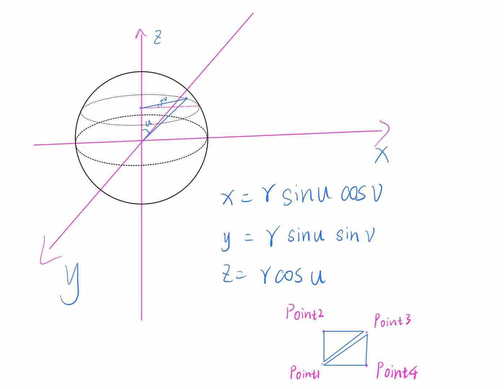
</center> 
所以小球顶点的计算，可以通过不同的 u,v 角度得到,然后每三个顶点连接成一个三角形就可以画出一个小球.

具体代码如下；
```c++
/*###################################################
##  函数: getPoint
##  函数描述： 根据 u，v 角度得到顶点
##  参数描述：
##  u,v 角度，值在[0,1]
#####################################################*/
Float3 getPoint(float u,float v){
	float r = 0.9f;
	Float3 point;
	point.x = r * sin(PI * u) * cos(2 * PI * v);    // u,v 的范围在[0,1],一个映射到[0,180],一个映射到[0,360],所以 v 要乘 2
	point.y = r * sin(PI * u) * sin(2 * PI * v);
	point.z = r * cos(PI * u);
	return point;
}

/*###################################################
##  函数: createSphere
##  函数描述： 创建球的顶点属性
##  参数描述：
##  	sphere: 球的顶点属性存放地址
##  	longitude: 经度细分程度
##		latitude: 纬度细分程度
#####################################################*/
void MyGLWidget::createSphere(GLfloat *sphere,GLuint longitude, GLuint latitude){
	GLfloat lon_step = 1.0f / longitude;		// 经度细分
	GLfloat lat_step = 1.0f / latitude;			// 纬度细分
	GLuint offset = 0;							// 顶点数组偏移量
	Float3 point1,point2,point3,point4;	
	Float3 nvector;
	float vec1[3],vec2[3],vec3[3];
	float D;

	for(int lat = 0; lat < latitude; lat++){
		for(int lon = 0; lon < longitude; lon++){
			// 一次得到四个点,生成两个三角形
			point1 = getPoint(lat * lat_step, lon * lon_step);
			point2 = getPoint((lat + 1) * lat_step, lon * lon_step);
			point3 = getPoint((lat + 1) * lat_step, (lon + 1) * lon_step);
			point4 = getPoint(lat * lat_step, (lon + 1) * lon_step);
			
			// 计算第一个三角形的顶点的法向量
			vec1[0] = point1.x - point4.x;
			vec1[1] = point1.y - point4.y;
			vec1[2] = point1.z - point4.z;

			vec2[0] = point1.x - point3.x;
			vec2[1] = point1.y - point3.y;
			vec2[2] = point1.z - point3.z;

			vec3[0] = vec1[1] * vec2[2] - vec1[2] * vec2[1];
			vec3[1] = vec2[0] * vec1[2] - vec2[2] * vec1[0];
			vec3[2] = vec2[1] * vec1[0] - vec2[0] * vec1[1];

			D = sqrt(pow(vec3[0], 2) + pow(vec3[1], 2) + pow(vec3[2], 2));
			
			nvector.x = vec3[0] / D;
			nvector.y = vec3[1] / D;
			nvector.z = vec3[2] / D;

			// 存储第一个顶点的位置信息和法向量
			memcpy(sphere + offset, &point1, sizeof(Float3));
			offset += 3;
			memcpy(sphere + offset, &nvector, sizeof(Float3));
			offset += 3;	
			memcpy(sphere + offset, &point4, sizeof(Float3));
			offset += 3;
			memcpy(sphere + offset, &nvector, sizeof(Float3));
			offset += 3;			
			memcpy(sphere + offset, &point3, sizeof(Float3));
			offset += 3;
			memcpy(sphere + offset, &nvector, sizeof(Float3));
			offset += 3;
			
			// 计算第二个三角形的顶点的法向量
			vec1[0] = point1.x - point3.x;
			vec1[1] = point1.y - point3.y;
			vec1[2] = point1.z - point3.z;

			vec2[0] = point1.x - point2.x;
			vec2[1] = point1.y - point2.y;
			vec2[2] = point1.z - point2.z;

			vec3[0] = vec1[1] * vec2[2] - vec1[2] * vec2[1];
			vec3[1] = vec2[0] * vec1[2] - vec2[2] * vec1[0];
			vec3[2] = vec2[1] * vec1[0] - vec2[0] * vec1[1];

			D = sqrt(pow(vec3[0], 2) + pow(vec3[1], 2) + pow(vec3[2], 2));
			
			nvector.x = vec3[0] / D;
			nvector.y = vec3[1] / D;
			nvector.z = vec3[2] / D;

			// 存储第一个顶点的位置信息和法向量
			memcpy(sphere + offset, &point1, sizeof(Float3));
			offset += 3;
			memcpy(sphere + offset, &nvector, sizeof(Float3));
			offset += 3;	
			memcpy(sphere + offset, &point3, sizeof(Float3));
			offset += 3;
			memcpy(sphere + offset, &nvector, sizeof(Float3));
			offset += 3;			
			memcpy(sphere + offset, &point2, sizeof(Float3));
			offset += 3;
			memcpy(sphere + offset, &nvector, sizeof(Float3));
			offset += 3;			
		}
	}
}
```
在上面的代码中,每次存入一个顶点位置属性,跟着也存入一个顶点法向量属性,便于后面的渲染操作。

#### 2. VBO 和 VAO
VBO 即 vertex buffer object, 顶点缓存对象,负责实际数据存储; VAO 即 vertex array object,记录数据结构的存储和如何使用的细节信息。

+ 关于 VBO 和 VAO 的 一些 API :
```c++
// VBO

// 创建 VBO
void glGenBuffers( GLsizei n, GLuint * buffers); // 这里n指定产生buffer的数目，而buffers则是标识符的地址。一次可以产生一个或者多个buffer.

// 将顶点数据传送到VBO或者为VBO预分配空间
void glBufferData( GLenum target,
                   GLsizeiptr size,
                   const GLvoid * data,
                   GLenum usage);
/*
1.函数中 target 参数表示绑定的目标，包括像 GL_ARRAY_BUFFER 用于 Vertex attributes(顶点属性)，GL_ELEMENT_ARRAY_BUFFER 用于索引绘制等目标。
2.size 参数表示需要分配的空间大小，以字节为单位。
3.data 参数用于指定数据源，如果 data 不为空将会拷贝其数据来初始化这个缓冲区，否则只是分配预定大小的空间。预分配空间后，后续可以通过 glBufferSubData 来更新缓冲区内容。 
4.usage 参数指定数据使用模式，例如 GL_STATIC_DRAW 指定为静态绘制，数据保持不变, GL_DYNAMIC_DRAW 指定为动态绘制，数据会经常更新。
*/

// 通知 OpenGL 如何解释这个顶点属性数组
 void glVertexAttribPointer( GLuint index,
                             GLint size,
                             GLenum type,
                             GLboolean normalized,
                             GLsizei stride,
                             const GLvoid * pointer);
/*
1. 参数 index 表示顶点属性的索引这个索引即是在顶点着色器中的属性索引,索引从 0 开始记起。
2. 参数 size 每个属性数据由几个分量组成。分量的个数必须为1,2,3,4这四个值之一。
3. 参数 type 表示属性分量的数据类型.
4. 参数 normalized 表示是否规格化，当存储整型时，如果设置为GL_TRUE,那么当被以浮点数形式访问时，有符号整型转换到[-1,1],无符号转换到[0,1]。否则直接转换为float型，而不进行规格化。
5. 参数stride表示连续的两个顶点属性之间的间隔，以字节大小计算。当顶点属性紧密排列(tightly packed)时，可以填0，由OpenGL代替我们计算出该值。
6. 参数pointer表示当前绑定到 GL_ARRAY_BUFFER缓冲对象的缓冲区中，顶点属性的第一个分量距离数据的起点的偏移量，以字节为单位计算。
*/

// VAO
// 使用VBO数据绘制物体
void glDrawArrays( GLenum mode,
                   GLint first,
                   GLsizei count);
/*
1.mode 参数表示绘制的基本类型，OpenGL预制了 GL_POINTS, GL_LINE_STRIP等基本类型。一个复杂的图形，都是有这些基本类型构成的。
2.first表示启用的顶点属性数组中第一个数据的索引。
3.count表示绘制需要的顶点数目。
*/
```

+ 这次实验 VBO 和 VAO 的具体创建过程:
注意OpenGL中创建一个对象, 由GLuint 类型来作为对象标识符, 而不允许使用自定义名字,这样就不会导致对象重名了。在下面的代码中, `vaoId` 和 `vboId` 是在 `.h` 声明的私有变量,类型是 `GLuint`.
```c++
/*###################################################
##  函数: initVboVao
##  函数描述： 初始化顶点缓冲区与顶点缓冲数组配置
##  参数描述：无
#####################################################*/
void MyGLWidget::initVboVao(){
	// 创建物体的 VAO

	// 创建并绑定相应功能指针
	glGenVertexArrays(1, &vaoId);
	glGenBuffers(1, &vboId);

	//绑定数组指针
	glBindVertexArray(vaoId);
	glBindBuffer(GL_ARRAY_BUFFER, vboId);
	//写入顶点数据
	glBufferData(GL_ARRAY_BUFFER, sizeof(vertices), vertices, GL_STATIC_DRAW);

	//设置顶点属性指针
	glVertexAttribPointer(0, 3, GL_FLOAT, GL_FALSE, 6 * sizeof(GLfloat), (GLvoid*)0);
	glEnableVertexAttribArray(0);

	// 设置法向量属性
	glVertexAttribPointer(1, 3, GL_FLOAT, GL_FALSE, 6 * sizeof(GLfloat), (GLvoid*)(3 * sizeof(GL_FLOAT)));
	glEnableVertexAttribArray(1);	

	//解绑VAO
	glBindVertexArray(0);
}
```
这样就创建了 VBO, 并将数据传送到了 GPU, 并告知了OpenGL如何解析这些数据。上面代码的最后, 暂时解绑了 VAO, 可以防止后续操作干扰到了当前 VAO 和 VBO。

在上面的过程中, VAO 记录了 VBO 的相关信息, 在以后绘图时, 只需要绑定对应的 VAO 就能找到对应的这些状态, 方便 OPenGL 使用:
```c++
	// 开始绘制物体
    glUseProgram(program);              // 使用着色器
	glPushMatrix();
    glBindVertexArray(vaoId);           // 使用VAO信息
    glDrawArrays(GL_TRIANGLES, 0, 6 * lats * lons);
    glBindVertexArray(0);
    glPopMatrix();
```
上面的代码使用了着色器,下面将介绍着色器。
#### 3. 着色器
顶点着色器负责将用户指定的顶点转换为内部表示,即做坐标转换,将顶点坐标处理为规范化设备坐标,范围为 [-1,1];片元着色器决定最终生成图像的颜色。顶点着色器的和片元着色器之间可以通过传递变量来沟通。

在程序中使用顶点或者片元着色器流程:

    （1）创建一个着色器对象
    （2）把着色器源代码编译为目标代码
    （3）验证这个着色器已经成功通过编译
    
    接着,把创建好的着色器加到一个着色器程序中:
    （1）创建一个着色器程序
    （2）把适当的着色器对象连接到这个着色器程序中
    （3）链接到着色器程序
    （4）验证这着色器阶段已经成功能完成
    （5）使用着色器进行顶点或者片断处理

即如下图所示:
<center>
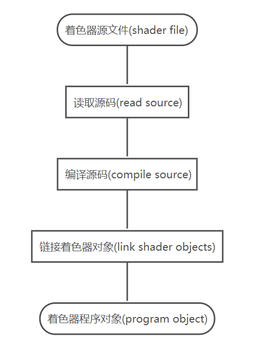
</center> 

实现中的主要代码:
```c++
/*###################################################
##  函数: initShader
##  函数描述： 初始化 Shader,加载到内存，编译链接
##  参数描述：
##  	vertexPath:	顶点着色器相对于该文件的路径
##		fragmentPath: 片元着色器相对于该文件的路径
##      ID: 着色器标识符
#####################################################*/
void MyGLWidget::initShader(const char *vertexPath, const char *fragmentPath,unsigned int *ID)
{
    /* 首先是读入着色器源码,在这里不具体列出 */

     //编译顶点着色器，在控制台输出LOG
     int success;
     char infoLog[512];
     vertexShader = glCreateShader(GL_VERTEX_SHADER);
     glShaderSource(vertexShader, 1, &vertexShaderSource, NULL);
     glCompileShader(vertexShader);
     glGetShaderiv(vertexShader, GL_COMPILE_STATUS, &success);
     if(!success)
     {
         glGetShaderInfoLog(vertexShader, 512, NULL, infoLog);
         cout << "error in vertexshader: compilation failed\n" << infoLog << endl;
     }
     else
         cout << "vertshader compiled successfully" << endl;

     //编译片元着色器，在控制台输出LOG
     fragmentShader = glCreateShader(GL_FRAGMENT_SHADER);
     glShaderSource(fragmentShader, 1, &fragmentShaderSource, NULL);
     glCompileShader(fragmentShader);
     glGetShaderiv(fragmentShader, GL_COMPILE_STATUS, &success);
     if (!success)
     {
         glGetShaderInfoLog(fragmentShader, 512, NULL, infoLog);
         cout << "error in fragmentshader: compilation failed\n" << infoLog << endl;
     }
     else
         cout << "fragmentshader compiled successfully" << endl;

     //绑定并链接着色器
     *ID = glCreateProgram();
     glAttachShader(*ID, vertexShader);
     glAttachShader(*ID, fragmentShader);
     glLinkProgram(*ID);
     glGetProgramiv(*ID, GL_LINK_STATUS, &success);
     if(!success)
     {
         glGetProgramInfoLog(*ID, 512, NULL, infoLog);
         cout << "error: link failed\n" << infoLog << endl;
     }
     else
         cout << "link successfully" << endl;

     glDeleteShader(vertexShader);
     glDeleteShader(fragmentShader);
}
```

在 shader object 链接到 program 后，即可断开链接，如果不需要再链接到其他program，比较好的做法就是释放资源:
```c++
/*###################################################
##  函数: ~MyGLWidget
##  函数描述： ~MyGLWidget类的析构函数，删除timer
##  参数描述： 无
#####################################################*/
MyGLWidget::~MyGLWidget()
{
	delete this->timer;

    //释放shader
    glDetachShader(program, vertexShader);
    glDetachShader(program, fragmentShader);
    glDeleteProgram(program);

    glDetachShader(lightId, lightVertShader);
    glDetachShader(lightId, lightFragShader);
    glDeleteProgram(lightId);
}
```
#### 4. 着色模型
实现中使用到的 GLSL 语言的一些语法:
    
    数据类型
    向量: vec3、vec4, 包含了 3、4 个浮点数的向量
    矩阵: mat3, 3x3的浮点数矩阵
    
    数据修饰词
    uniform: 把客户端代码(App端)传递到顶点着色器(vertex)和片元着色器(fragment)里面用到的变量。使用gluiform传递参数。
    in、out: 显示地表明变量为输入或输出

另外着色器文件没有规定的后缀,可以使用自己喜欢的名字命名着色器文件。

+ ##### Phong 着色模型
Phong 着色模型的光照计算是在片元着色器中进行的。总的来说, Phong Reflection = Ambient + Diffuse + Specular。

顶点着色器实现:
```c++
/*###################################################
##  顶点着色器
##  描述： 根据顶点位置和法向量,输出顶点的颜色和法向量以及位置的变换,用于着色器计算漫反射
#####################################################*/
#version 410 core
layout (location = 0) in vec3 aPos;         // 顶点位置
layout (location = 1) in vec3 normal;       // 顶点法向量

out vec3 vertColor;                         // 顶点颜色
out vec3 FragNormal;                        // 法向量经过 model 变换后值
out vec3 FragPos;                           // 在世界坐标系中的位置

uniform mat4 projection;                    // PROJECTIN 矩阵
uniform mat4 model;                         // MODEL 矩阵
uniform mat4 view;                          // VIEW 矩阵

void main(){
    gl_Position = projection * view * model * vec4(aPos, 1.0);              // 设置顶点位置
    vertColor = (vec3(gl_Position.xyz) + vec3(0.1f,0.1f,0.1f)) * 0.5f;      // 设置顶点颜色
    mat3 normalMatrix = mat3(transpose(inverse(model)));                    
    FragNormal = normalMatrix * normal;                                     // 计算法向量经过模型变换后值
    FragPos = vec3(model * vec4(aPos, 1.0));                                // 计算顶点在世界坐标系中的位置
}
```
其中 location 是顶点属性索引,即在创建 VBO,解释属性时的 index。 `projection`,`model`，`view` 等矩阵是从程序端中设置的:
```c++
	float mat[16];

	//设置shader参数
	glMatrixMode(GL_MODELVIEW);
	glLoadIdentity();
	glTranslatef(0.0f, 0.0f, -10.0f);			// 将球初始位置置于沿 z 轴负方向平移 10 个单位
	// glRotatef(body, 0, 1, 0);				// 绕 y 轴顺时针旋转 body°
	
	glGetFloatv(GL_MODELVIEW_MATRIX, mat);
	glUniformMatrix4fv(glGetUniformLocation(program, "model"), 1, GL_FALSE, mat);
	glLoadIdentity();
	glGetFloatv(GL_MODELVIEW_MATRIX, mat);
	glUniformMatrix4fv(glGetUniformLocation(program, "view"), 1, GL_FALSE, mat);
	// 投影变换
	glMatrixMode(GL_PROJECTION);
	glLoadIdentity();
	gluPerspective(20.0f, width() / height(), 0.1f, 1000.0f);		// 放置摄像机
	glGetFloatv(GL_PROJECTION_MATRIX, mat);
	glUniformMatrix4fv(glGetUniformLocation(program, "projection"), 1, GL_FALSE, mat);
```

片元着色器实现:
```c++
/*###################################################
##  片元着色器
##  描述： 根据物体颜色、物体位置、顶点法向量计算 phong shading
#####################################################*/
#version 410 core
in vec3 vertColor;      // 物体颜色
in vec3 FragPos;        // 物体在世界坐标的位置
in vec3 FragNormal;     // 法向量
in vec4 lightPos;       // 光的位置
out vec4 FragColor;     // 最终渲染的颜色

//vec3 lightColor = vec3(1.0f, 1.0f, 1.0f);     // 光的强度
vec3 lightColor = vec3(0.5f, 0.5f, 0.5f);       // 光的强度
vec3 viewPos = vec3(0.0f,0.0f,0.0f);            // 观察位置

void main(){
    // 环境光
    float ambientStrength = 0.1;
    vec3 ambient = ambientStrength * lightColor * vertColor;

    // 漫反射光成分
    vec3 lightDir = normalize(lightPos.xyz - FragPos);
    vec3 normal = normalize(FragNormal);
    float diffFactor = max(dot(normal, lightDir), 0.0);
    vec3 diffuse = diffFactor * lightColor * vertColor;

    // 镜面反射成分
    float   specularStrength = 1.0f;
    vec3    reflectDir = normalize(reflect(-lightDir, normal));
    vec3    viewDir = normalize(viewPos - FragPos);
    float   specFactor = pow(max(dot(reflectDir, viewDir), 0.0), 32);           // 最后一个参数为镜面高光系数
    vec3    specular = specularStrength * specFactor * lightColor * vertColor;    

    vec3 result = ambient + diffuse + specular; 
    FragColor = vec4(result,1.0f);
}

```
以上关于光的具体计算原理参考[官方文档](https://learnopengl-cn.github.io/02%20Lighting/02%20Basic%20Lighting/)

+ ##### Ground 着色模型
Ground 模型和 Phong 模型的主要区别就是: Phong Shading 光照计算是在片元着色器中进行的;而 Ground Shading 在顶点着色器中进行光照计算。 所以只需要将上面 Phong 模型实现的片元着色器的光照计算搬到 Ground 模型的顶点着色器即可。 
+ ##### Flat 着色模型
Flat Shading 是相对于 Ground Shading 来说的,在shader中要实现flat shading非常简单，只要在 in out 参数的前面加上flat关键字就可以了:

顶点着色器:
```c++
flat out vec3 vertColor;					// 计算后的顶点颜色
```

片元着色器:
```c++
flat in vec3 vertColor;
```
+ ##### Cartoon 着色模型
简单的 Cartoon 渲染的算法流程:

    指定一个颜色作为物体的基础颜色；
    通过光照计算得出每个片元对应的亮度；
    将亮度由连续的映射到离散的若干个亮度值；
    将亮度值和基础颜色结合得到片元颜色。

顶点着色器:
```c++
/*###################################################
##  顶点着色器
##  描述： 根据顶点位置和法向量,输出顶点的颜色和法向量以及位置的变换,用于片元着色器计算 Cartoon 模型
#####################################################*/
#version 410 core
layout (location = 0) in vec3 position;			// 顶点位置
layout (location = 1) in vec3 normal;			// 顶点法向量

out vec3 vertColor;								// 顶点颜色				
out vec3 vertNormal;							// 法向量经过模型变换后值
out vec3 vertLight;								// 光经过变换后的值

uniform mat4 projection;						// PROJECTION 矩阵
uniform mat4 model;								// MODEL 矩阵
uniform mat4 view;								// VIEW 矩阵

//vec3 lightColor = vec3(1.0f, 1.0f, 1.0f);  		// 光的强度
vec3 lightColor = vec3(0.5f, 0.5f, 0.5f);  	// 光的强度
vec3 lightPos = vec3(-2.0f, -2.0f, 0.0f);       // 光的位置

void main(){
	
	mat3 normalMatrix = mat3(transpose(inverse(model)));
	vertNormal = normalize(normalMatrix * normal);			// 计算法向量经过模型变换后值

	vec4 viewLight = vec4(lightPos, 1.0);
	vertLight = viewLight.xyz;								// 计算光经过坐标变换后的值

	gl_Position = projection * view * model * vec4(position, 1.0);			// 设置顶点位置
	vertColor = (vec3(gl_Position.xyz) + vec3(1.0f,1.0f,1.0f)) * 0.5f;		// 设置顶点颜色
}
```

片元着色器:
```c++
/*###################################################
##  片元着色器
##  描述： 根据顶点颜色和法向量和光照,得到 cartoon 模型
#####################################################*/
#version 410 core
in vec3 vertColor;          // 顶点颜色
in vec3 vertNormal;         // 法向量经过模型变换后值
in vec3 vertLight;          // 光经过变换后的值
out vec4 FragColor;         // 片元颜色

void main(){
    float diffuse = dot(normalize(vertLight), vertNormal);
    if (diffuse > 0.8) {
        diffuse = 1.0;
    }
    else if (diffuse > 0.5) {
        diffuse = 0.6;
    }
    else if (diffuse > 0.2) {
        diffuse = 0.4;
    }
    else {
        diffuse = 0.2;
    }
    FragColor = vec4(vertColor * diffuse, 1.0);
}

/*void main(){
    float silhouette = length(vertNormal * vec3(0.0, 0.0, 1.0));
    if (silhouette < 0.5) {
        silhouette = 0.0;
    }
    else {
        silhouette = 1.0;
    }

    float diffuse = dot(normalize(vertLight), vertNormal);
    if (diffuse > 0.8) {
        diffuse = 1.0;
    }
    else if (diffuse > 0.5) {
        diffuse = 0.6;
    }
    else if (diffuse > 0.2) {
        diffuse = 0.4;
    }
    else {
        diffuse = 0.2;
    }
    diffuse = diffuse * silhouette;
    FragColor = vec4(vertColor * diffuse, 1.0);
}*/
```
参考博客:[卡通渲染](https://zhuanlan.zhihu.com/p/25939794),第一个 main 函数实现的是 卡通渲染,第二个 main 实现的是描边和卡通渲染相结合。

#### 5. 完善
仅在 phong 模型中实现了下面的漩涡效果,效果在提交的视频中展示。
##### 1. 根据顶点在三维空间中的位置指明颜色
在顶点着色器中设置物体颜色:
```c++
vec3 objectColor = (vec3(gl_Position.xyz) + vec3(1.0f,1.0f,1.0f)) * 0.5f;	// 计算物体颜色
```

##### 2. 对小球进行形变，twisting
在顶点着色器中设置顶点位置:
```c++
uniform float twisting;

void main(){
    // twisting
    float Angle = twisting * length(aPos.xy);
    float s = sin(Angle);
    float c = cos(Angle);
    vec3 Pos;
    Pos.x = c * aPos.x - s * aPos.y;
    Pos.y = s * aPos.x + c * aPos.y;
    Pos.z = aPos.z;
    gl_Position = projection * view * model * vec4(Pos, 1.0);    
}
```
### 四、 实验结果
在下面的结果中,使用了两个着色器绘图。一个着色器用来绘制光源，光源用一个缩小的立方体来模拟,另一个着色器用来绘制球体。
#### 1. 比较着色模型
+ ##### Flat 着色模型
**环境光:**
<center>
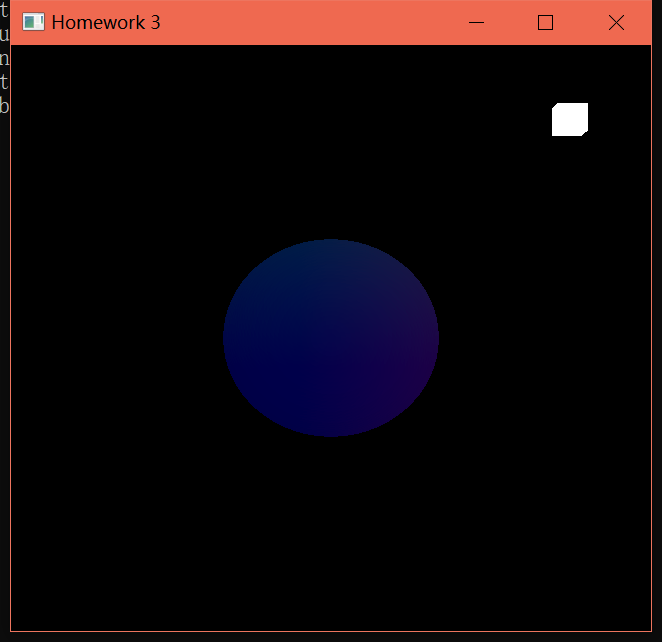
</center> 
  		**漫反射:**

<center>
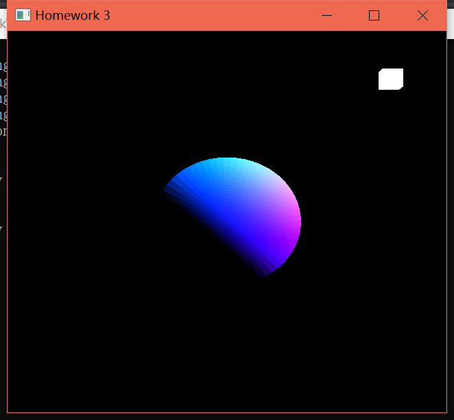
</center> 

​		**镜面反射:**
<center>
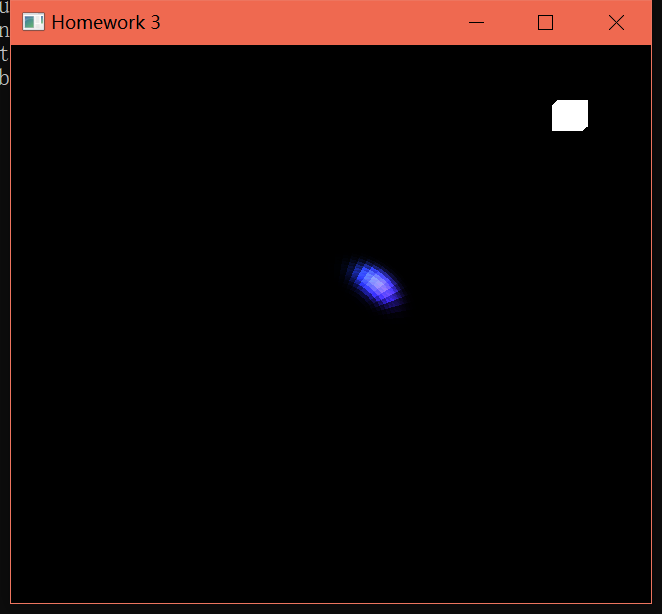
</center> 

+ ##### Ground 着色模型

  ##### **环境光:**
<center>

</center> 

​		**漫反射:**
<center>
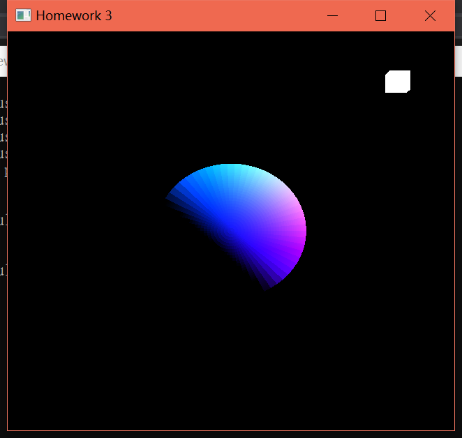
</center> 

​		**镜面反射:**
<center>
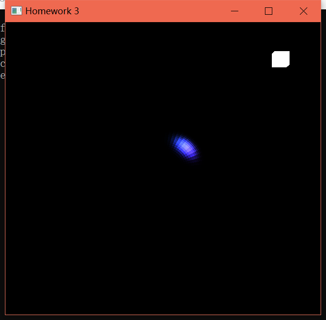
</center> 

+ ##### Phong 着色模型
**环境光:**
<center>
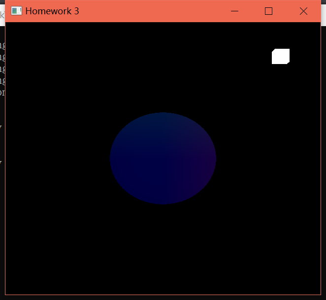
</center> 

​			**漫反射:**
<center>
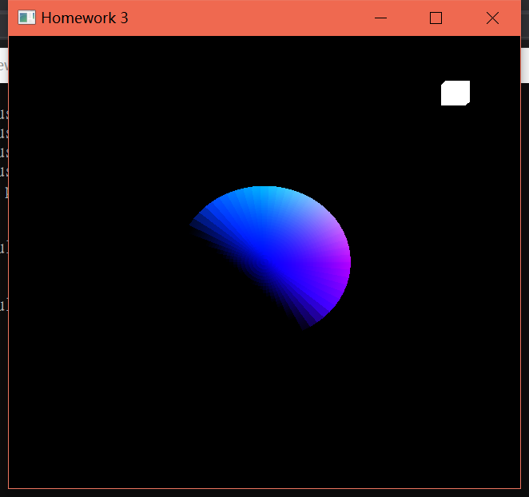
</center> 

​	**镜面反射:**
<center>
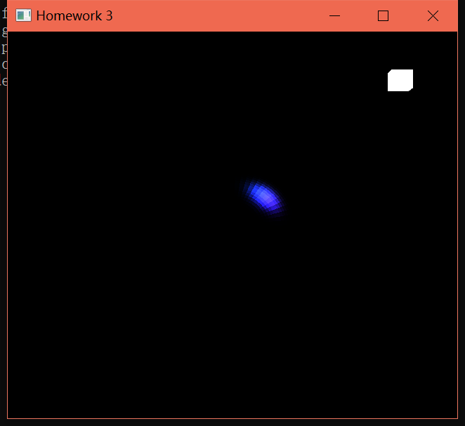
</center> 

从以上结果图可以更好的理解到,环境光就是模拟给物体一点光,不至于物体全黑;漫反射,当物体面向光源的一面就会反射光,而背对光源的一面就得不到光;镜面反射,观察点的位置会有一个亮点。

+ #### 四种着色模型最终效果
<center>


</center>
​																Flat 模型																Ground 模型


<center>
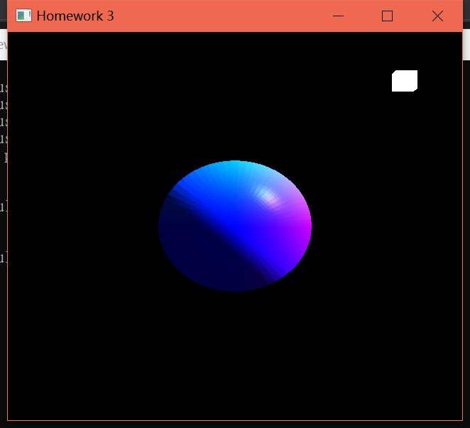
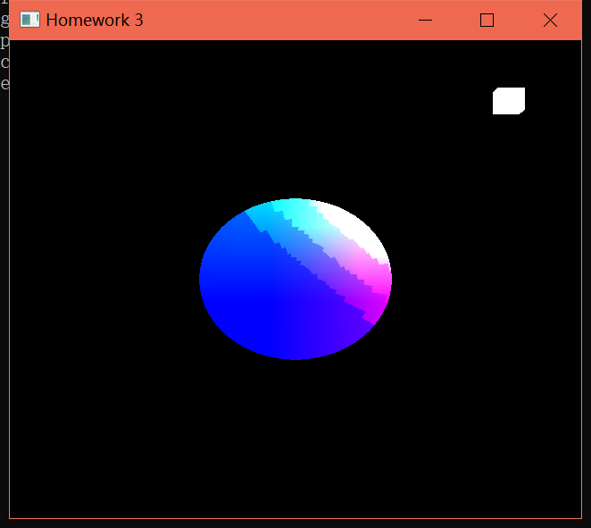
</center>
​															Phong 模型														 Cartoon 模型

可以看到 Flat 和 Ground 模型只有很细微的差别(事实上,当网格细分越粗糙的时候,两者的差别才比较明显), 而 phong 模型的镜面反射同上面两种模型有些差异,卡通模型差异就更明显了。
#### 2. 比较参数变化
+ ##### Flat 着色模型改变光照强度
<center>

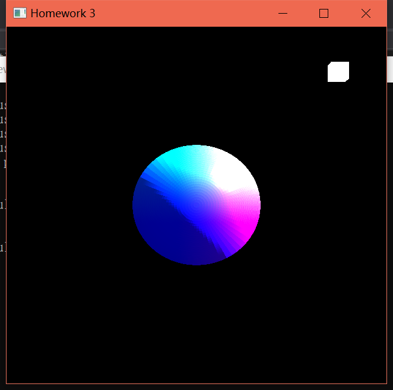
</center>

+ ##### Ground 着色模型改变光照强度
<center>

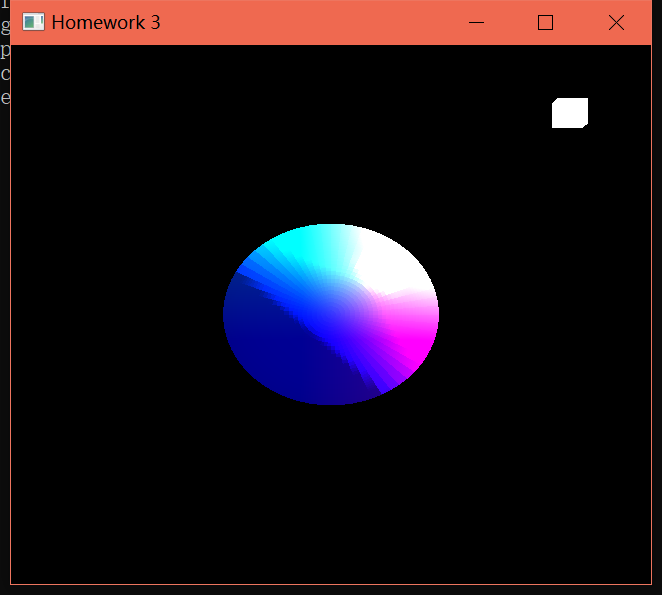
</center>

+ ##### Phong 着色模型改变光照强度
<center>

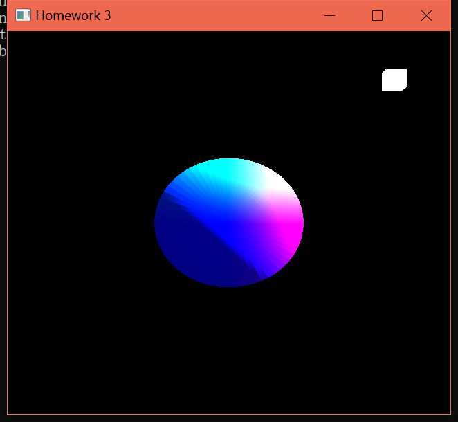
</center>

以上参数调整都是左图向右图增强光照,可以看到这三种模型改变光照强度的时候,面向光源的一面的颜色很明显的变得更亮了。

+ ##### Flat 着色模型改变镜面反射指数
<center>


</center>
​																		32																		128


<center>


</center>
​																		256																		512


+ ##### Ground 着色模型改变镜面反射指数
<center>


</center>
​																		32																		128


<center>


</center>
​																		256																		512

+ ##### Phong 着色模型改变镜面反射指数
<center>


</center>
​																		32																		128


<center>


</center>
​																		256																		512


上面的图可以看到,反射指数值越大,高光部分越集中。

#### 3. 比较小球细分程度影响
修改代码中的经度和纬度细分程度进行分析:
```c++
#define lats 32		// 纬度细分
#define lons 32		// 经度细分
```
+ ##### Flat 着色模型
<center>
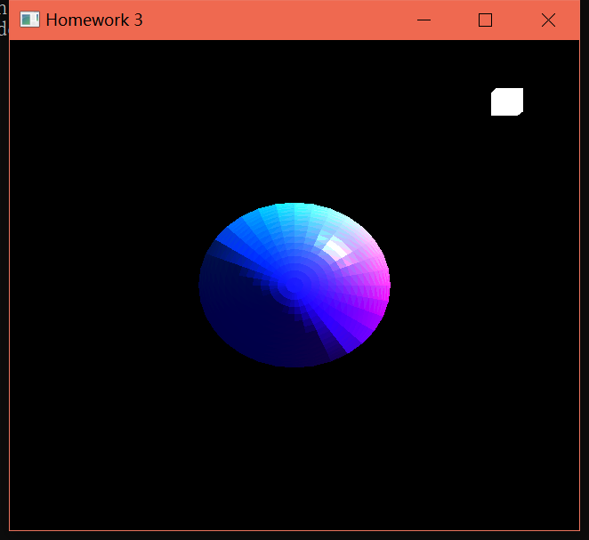

</center>
​																32 * 32																	128 * 128


<center>
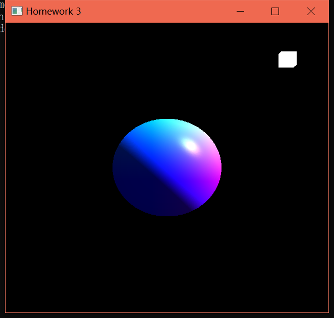
</center>
​																										512 * 512


+ ##### Ground 着色模型
<center>
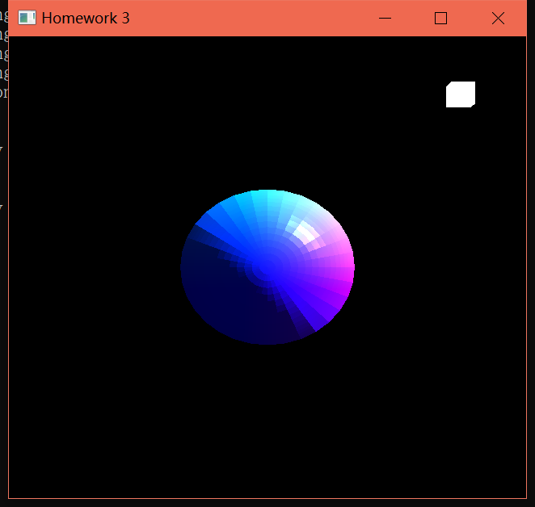
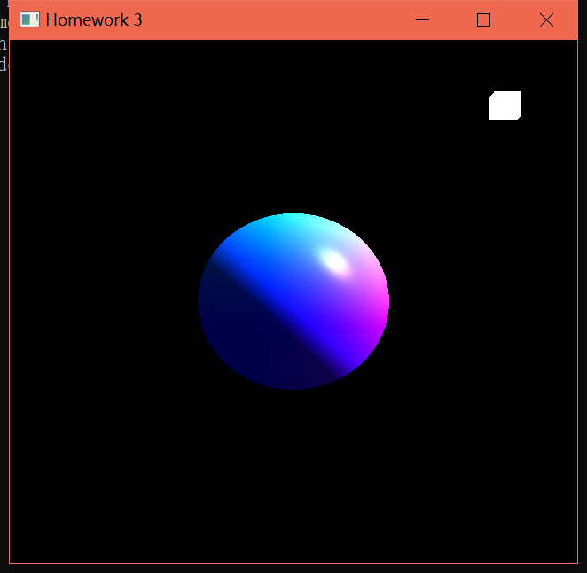
</center>
​																32 * 32																	128 * 128


<center>
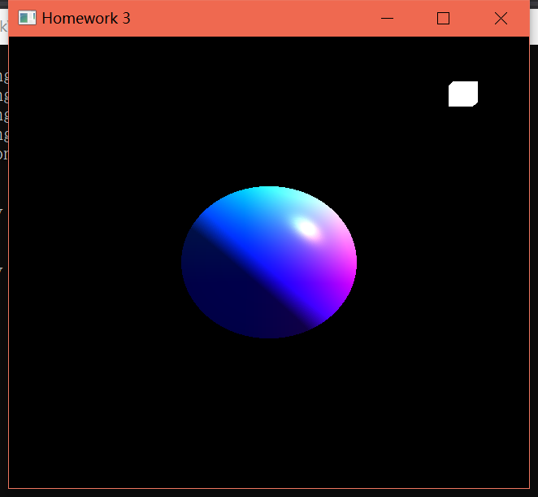
</center>
​																										512 * 512


注意看 Flat 模型和 Ground 模型的 32 * 32, 就会发现这两种模型的着色还是有些差异的,

+ ##### Phong 着色模型

<center>
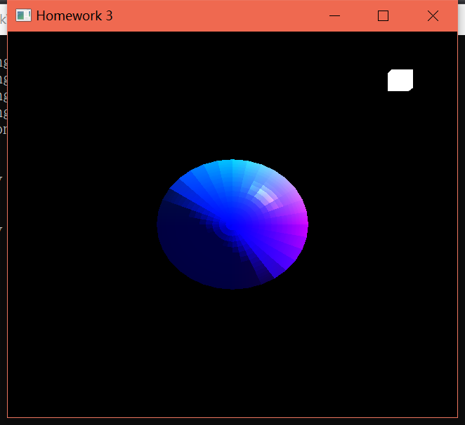
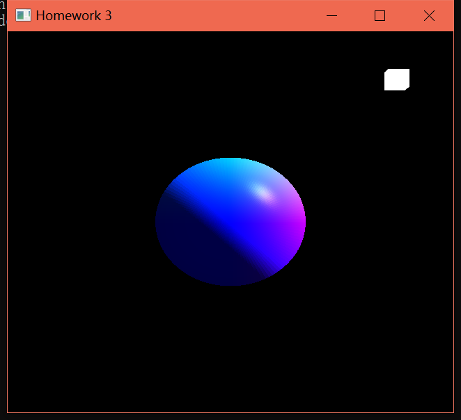
</center>

​																32 * 32																	128 * 128


<center>
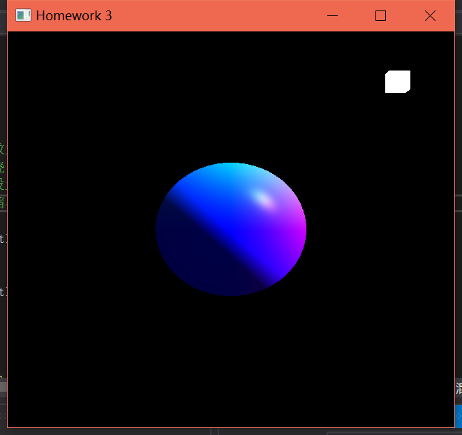
</center>
​																										512 * 512


+ ##### Cartoon 着色模型

<center>
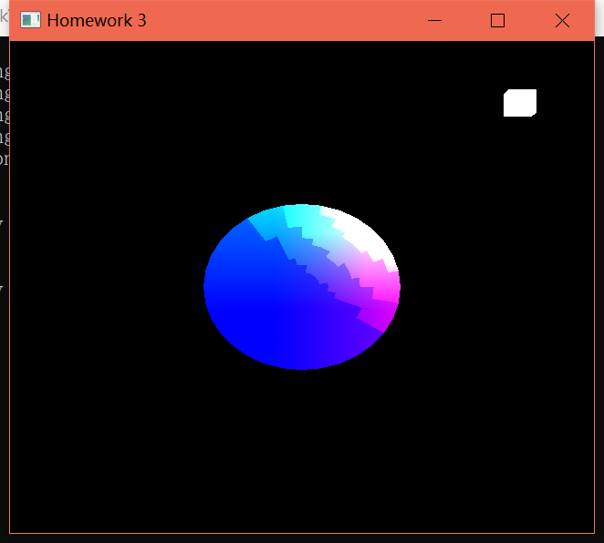

</center>
​																32 * 32																	128 * 128


<center>
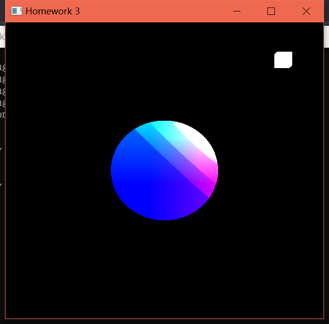
</center>
​																										512 * 512

在以上模型中,网格细分程度越大,小球看起来越平滑,但随着小球平滑到一定程度,网格继续细分的结果差异也不是很大。

其他一些参数的影响: 

+ 环境光强度: 环境光越强,则物体整体看起来会更亮
+ 漫反射强度: 该成分越强则物体面向光源的一面会更亮
+ 镜面反射强度: 该成分越强则观察点部分越亮

### 五、 实验总结
+ 收获和感想
  1. 完成了这次作业之后,我才明白 VBO, VAO 是什么以及怎么用。Opengl 绘制方式分为传统模式和现代方式,在第二次作业中,我们使用 `glBegin` 、`glEnd` 的方式绘制即为传统的立即模式(传统方式还包括有显示列表);而在这次作业中,我们使用现代的 VBO,VAO 结合 shader 的模式,其优势相比于传统模式在于快。另外传统模式当数据量增大时,代码量需要更多(会有更多的 gl* 语句)。
  
+ 尝试
  
  在分析曲面细分程度的影响时,尝试用细分着色器实现。了解到绘制流程大致是: 顶点着色器 -> 细分控制着色器 -> 细分求值着色器 -> 片元着色器。但实现的效果很差(可能是实现过程有什么错误而我没理解到):
<center>
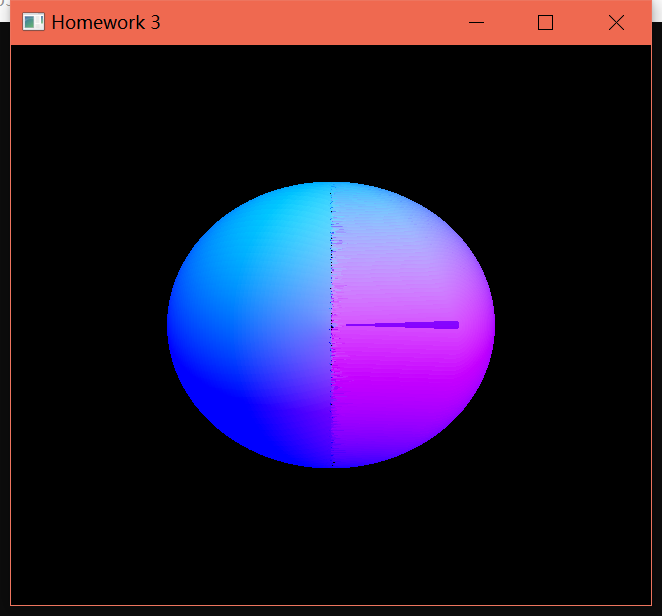
</center>
  像上图一样中间会有一道很明显的分界。最后还是在程序端生成点的时候,去控制细分程度。

+ 总结
  

使用着色器的主要流程:

    (1) 用户在程序中指定或者加载顶点属性数据
    (2) 将顶点属性数据传送到 GPU，由顶点着色器处理顶点数据
    (3) 由片元着色器负责最终图形的颜色

### 六、 参考博客
1. [OpenGL着色器介绍](http://www.twinklingstar.cn/2013/793/basic-shader/)
2. [learnopengl](https://learnopengl-cn.github.io/01%20Getting%20started/05%20Shaders/)
3. [GL02-02:OpenGL球体绘制](https://www.jianshu.com/p/48a4b3f3d51e)
4. [OpenGL学习脚印: 绘制一个三角形](https://blog.csdn.net/wangdingqiaoit/article/details/51318793)
5. [OpenGL学习脚印: 基本图形绘制方式比较(glBegin,glCallList,glVertexPointer,VBO)](https://blog.csdn.net/wangdingqiaoit/article/details/38920103)
6. [OpenGL学习脚印: 光照基础(basic lighting)](https://blog.csdn.net/wangdingqiaoit/article/details/51638260)
7. [openGL之API学习（七十六）GLSL的内置变量 预定义变量](https://blog.csdn.net/hankern/article/details/90524114)
8. [OpenGL进阶(十二) - 基础着色(Shading)](https://blog.csdn.net/silangquan/article/details/10011169)
9. [卡通渲染](https://zhuanlan.zhihu.com/p/25939794)
10. [曲面细分着色器(Tessellation)](https://blog.csdn.net/liyazhen2011/article/details/102720444)