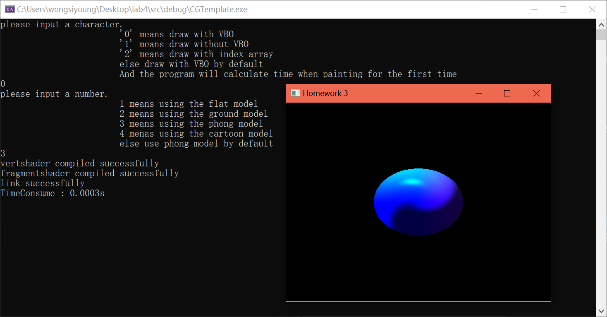

### 一、 实验题目
讨论绘制方式的效率

### 二、 实验要求
1. 使用 VBO 对作业 3 小球进行绘制
   
    使用足够的细分产生充足的顶点和三角面片，便于计算绘制时间
2. 讨论是否使用 VBO 的效率区别
3. 讨论是否使用 index array 的效率区别
   
### 三、 实验过程
因为在 lab 3 的时候使用了 vbo 对小球进行绘制，所以在这次实验中，在 lab 3 的代码基础上，增加不使用 vbo 绘制和使用 index array 绘制两种方式对小球进行绘制。
#### 1. 不使用 vbo 绘制
不使用 vbo 绘制，则用之前的绘制方式，用 gl* 传递顶点数据

```c++
/*###################################################
##  函数: DrawWithoutVBO
##  函数描述： 不使用 vbo 方式绘制
##  参数描述：无
#####################################################*/
void MyGLWidget::DrawWithoutVBO(){
    glUniform1f(glGetUniformLocation(program, "twisting"), angle);

	glBegin(GL_TRIANGLES);
	for(int i = 0; i < 6 * 3 * lats * lons * 2; i = i+6){
		glVertex3f(vertices[i],vertices[i+1],vertices[i+2]);
		glNormal3f(vertices[i+3],vertices[i+4],vertices[i+5]);
	}
	glEnd();	
}
```
以上代码用 `glVertex3f` 传递顶点位置，用 `glNormal3f` 传递法向量数据,其中 `vertices` 存储的是一个顶点位置(x,y,z)，一个顶点的法向量(nx,ny,nz),所以一个顶点的位置和法向量信息是连续的 6 个数组索引。

在 lab3 的代码中,着色器的变量设置是在绘制的时候传递的，在这次实验中，把固定的变量传递抽取出来封装成函数，而 `twisting` 的传递(漩涡度数)是改变的就在每一次绘制的时候传递，PROJECTION 和 MODELVIEW 矩阵是不变的，就在编译着色器之后初始化
```c++
/*###################################################
##  函数: initShader
##  函数描述： 初始化Shader,加载到内存，编译链接
##  参数描述：
##  	vertexPath:	顶点着色器相对于该文件的路径
##		fragmentPath: 片元着色器相对于该文件的路径
#####################################################*/
void MyGLWidget::initShader(const char *vertexPath, const char *fragmentPath,unsigned int *ID){
    ·
    读取 shader 源码，编译链接
    ·
    // 初始化 shader 变量
    initShaderVariables();
}

/*###################################################
##  函数: initShaderVariables
##  函数描述： 初始化着色器参数
##  参数描述：无
#####################################################*/
void MyGLWidget::initShaderVariables(){
	glUseProgram(program);
	float mat[16];

	//设置shader参数
	glMatrixMode(GL_MODELVIEW);
	glLoadIdentity();
	glTranslatef(0.0f, 0.0f, -10.0f);			// 将球初始位置置于沿 z 轴负方向平移 10 个单位
	// glRotatef(body, 0, 1, 0);				// 绕 y 轴顺时针旋转 body°
	// glTranslatef(0.0f, 0.0f, 1.0f);			// 设置球的旋转半径
	glGetFloatv(GL_MODELVIEW_MATRIX, mat);
	glUniformMatrix4fv(glGetUniformLocation(program, "model"), 1, GL_FALSE, mat);
	glLoadIdentity();
	glGetFloatv(GL_MODELVIEW_MATRIX, mat);
	glUniformMatrix4fv(glGetUniformLocation(program, "view"), 1, GL_FALSE, mat);
	// 投影变换
	glMatrixMode(GL_PROJECTION);
	glLoadIdentity();
	gluPerspective(30.0f, width() / height(), 0.1f, 1000.0f);		// 放置摄像机
	glGetFloatv(GL_PROJECTION_MATRIX, mat);
	glUniformMatrix4fv(glGetUniformLocation(program, "projection"), 1, GL_FALSE, mat);	
}
```
#### 2. 使用 index array 绘制
index array 的思想是，不重复存储顶点信息，而是用一个索引数组去指示一个面由哪些顶点组成，记录顶点在数组中的索引位置。例如，在 lab3 中，生成球的顶点位置的时候，是用 4 个顶点绘制两个三角形(6 个顶点),这样就会有 2 个顶点的数据是重复存储的:
```c++
    // 得到 4 个顶点位置
    point1 = getPoint(lat * lat_step, lon * lon_step);
    point2 = getPoint((lat + 1) * lat_step, lon * lon_step);
    point3 = getPoint((lat + 1) * lat_step, (lon + 1) * lon_step);
    point4 = getPoint(lat * lat_step, (lon + 1) * lon_step);

    // 存储第一个顶点的位置信息和法向量
    memcpy(sphere + offset, &point1, sizeof(Float3));
    offset += 3;
    memcpy(sphere + offset, &nvector, sizeof(Float3));
    offset += 3;	
    memcpy(sphere + offset, &point4, sizeof(Float3));
    offset += 3;
    memcpy(sphere + offset, &nvector, sizeof(Float3));
    offset += 3;			
    memcpy(sphere + offset, &point3, sizeof(Float3));
    offset += 3;
    memcpy(sphere + offset, &nvector, sizeof(Float3));
    offset += 3;

                // 存储第一个顶点的位置信息和法向量
    memcpy(sphere + offset, &point1, sizeof(Float3));
    offset += 3;
    memcpy(sphere + offset, &nvector, sizeof(Float3));
    offset += 3;	
    memcpy(sphere + offset, &point3, sizeof(Float3));
    offset += 3;
    memcpy(sphere + offset, &nvector, sizeof(Float3));
    offset += 3;			
    memcpy(sphere + offset, &point2, sizeof(Float3));
    offset += 3;
    memcpy(sphere + offset, &nvector, sizeof(Float3));
    offset += 3;		
```
比如上面代码中的 `point1` 和 `point3` 就存储了两次，而 index array 是这 4 个顶点只存储一次，那么 lab 3 的存储顶点数组要做一些修改和申请一个数组做索引:
```c++
#define lats 512		// 纬度细分
#define lons 512		// 经度细分

GLfloat verticesIndex[4 * 3 * lats * lons * 2];  	// 顶点属性数组, 存放顶点值和法向量,顶点不重复存储
GLuint index[6 * lats * lons];						// 索引顶点数组
```
申请 `4 * 3 * lats * lons * 2` 的 size 是因为一共循环 `lats * lons` 次，每次存储 4 个顶点，每个顶点是三维的，一个顶点包括位置信息和法向量信息，而 `6 * lats * lons` 是因为一共循环 `lats * lons` 次，每次是 4 个顶点绘制两个三角形(6 个顶点),所以需要索引 6 个顶点的位置。

修改之前的生成球的顶点函数如下:
```c++
/*###################################################
##  函数: createSphere2
##  函数描述： 创建球的顶点属性，顶点不重复存储
##  参数描述：
##  	sphere: 球的顶点属性存放地址
##  	longitude: 经度细分程度
##		latitude: 纬度细分程度
#####################################################*/
void MyGLWidget::createSphere2(GLfloat *sphere,GLuint longitude, GLuint latitude){
	GLfloat lon_step = 1.0f / longitude;		// 经度细分
	GLfloat lat_step = 1.0f / latitude;			// 纬度细分
	GLuint offset = 0;							// 顶点数组偏移量
	GLuint indexOffset = 0;
	Float3 point1,point2,point3,point4;	
	Float3 nvector;
	float vec1[3],vec2[3],vec3[3];
	float D;

	for(int lat = 0; lat < latitude; lat++){
		for(int lon = 0; lon < longitude; lon++){
			// 一次得到四个点,生成两个三角形
			point1 = getPoint(lat * lat_step, lon * lon_step);
			point2 = getPoint((lat + 1) * lat_step, lon * lon_step);
			point3 = getPoint((lat + 1) * lat_step, (lon + 1) * lon_step);
			point4 = getPoint(lat * lat_step, (lon + 1) * lon_step);
			
			// 计算第三角形的顶点的法向量
			vec1[0] = point1.x - point4.x;
			vec1[1] = point1.y - point4.y;
			vec1[2] = point1.z - point4.z;

			vec2[0] = point1.x - point3.x;
			vec2[1] = point1.y - point3.y;
			vec2[2] = point1.z - point3.z;

			vec3[0] = vec1[1] * vec2[2] - vec1[2] * vec2[1];
			vec3[1] = vec2[0] * vec1[2] - vec2[2] * vec1[0];
			vec3[2] = vec2[1] * vec1[0] - vec2[0] * vec1[1];

			D = sqrt(pow(vec3[0], 2) + pow(vec3[1], 2) + pow(vec3[2], 2));
			
			nvector.x = vec3[0] / D;
			nvector.y = vec3[1] / D;
			nvector.z = vec3[2] / D;

			// 1 4 3、 1 3 2 顶点顺序
			index[indexOffset] = offset / 6 + 1 - 1;
			indexOffset++;
			index[indexOffset] = offset / 6 + 4 - 1;
			indexOffset++;
			index[indexOffset] = offset / 6 + 3 - 1;
			indexOffset++;

			index[indexOffset] = offset / 6 + 1 - 1;
			indexOffset++;
			index[indexOffset] = offset / 6 + 3 - 1;
			indexOffset++;
			index[indexOffset] = offset / 6 + 2 - 1;
			indexOffset++;


			// 存储 4 个顶点的位置和法向量
			memcpy(sphere + offset, &point1, sizeof(Float3));
			offset += 3;
			memcpy(sphere + offset, &nvector, sizeof(Float3));
			offset += 3;	
			memcpy(sphere + offset, &point2, sizeof(Float3));
			offset += 3;
			memcpy(sphere + offset, &nvector, sizeof(Float3));
			offset += 3;			
			memcpy(sphere + offset, &point3, sizeof(Float3));
			offset += 3;
			memcpy(sphere + offset, &nvector, sizeof(Float3));
			offset += 3;
			memcpy(sphere + offset, &point4, sizeof(Float3));
			offset += 3;
			memcpy(sphere + offset, &nvector, sizeof(Float3));
			offset += 3;

		}
	}
}
```
如上代码同 lab3 的差不多，也是先通过 `getPoint` 得到顶点的位置，然后用其中 3 个顶点计算这个面的法向量(lab3 的时候是每次用 3 个顶点计算一个三角形面的法向量，那么重复存储的两个顶点就会有两个法向量，在这里修改的时候思考了一下，lab3 的的第二个法向量计算有点多余，这四个顶点的法向量是都一样的，所以就只拿其中三个顶点计算法向量),一次存储 4 个顶点的位置和法向量，不重复存储。

数组索引的计算，因为存储的顶点顺序是:`point1、point4、point3` 和 `point1、point3、point2`。比如第一个三角形的 `point1` 的索引:`offset / 6 + 1 - 1`，其中 `offset` 是不重复存储的顶点数组的偏移量, 除以 6 是因为每个顶点有 6 个信息记录(位置 x,y,z 和法向量 nx,ny,nz),这样就得到这次顶点索引的相对偏移量，`+1` 是因为 `point1` 的相对索引为 1(同理 `pointX` 就是 `+X`), `-1` 是因为数组索引从 0 开始，所以每个索引都要 `-1`。 

这样顶点位置存储和索引数组就准备好了。lab3 绘制的时候是用 `glDrawArrays`，其中 `glDrawArrays` 用于一次性将指定内存区间的所有点绘制出来,不用索引,即顶点数组中已经存放好了顶点的绘制顺序,所以用 index array 的话，这部分也要做相应的修改,使用 `glDrawElements` 调用索引来绘制图形。 

api 说明:
```c++
// 启用和关闭顶点数组

glEnableClientState(GL_VERTEX_ARRAY);   //启用
glDisableClientState(GL_VERTEX_ARRAY);  //关闭

// 其中，GL_VERTEX_ARRAY是数组的类型，共有八种：
GL_VERTEX_ARRAY
GL_COLOR_ARRAY
GL_SECOND_COLOR_ARRAY
GL_INDEX_ARRAY
GL_NORMAL_ARRAY
GL_FOG_COORDINATE_ARRAY
GL_TEXTURE_COORD_ARRAY
GL_FLAG_ARRAY

// 指定顶点数组
void glVertexPointer( GLint size,     // 每个顶点的坐标数目，必须是2,3，或4
                    GLenum type,    // 顶点坐标的数据类型，GL_SHORT， GL_INT， GL_FLOAT 或 GL_DOUBLE
                    GLsizei stride, // 两个相邻顶点之间的偏移量，单位为字节，如果为0，表面顶点是紧密存储的
                    const GLvoid* pointer); // 数组中第一项的第一个坐标的内存地址

// 指定法向量数组
void glNormalPointer(GLenum type, GLsizei stride, const GLvoid* pointer)

// 还有其他的指定数组,但在这次实验中只用了顶点数组和法向量数组
glVertexPointer()：指定顶点坐标数组指针
glNormalPointer()：指定法线数组指针
glColorPointer()：指定RGB颜色数组指针
glIndexPointer()：指定索引颜色数组指针
glTexCoordPointer()：指定纹理坐标数组指针
glEdgeFlagPointer()：指定边标志数组指针

// 绘制图形
void glDrawElements(GLenum mode,        // 指定绘制图元的类型，取值为：GL_POINTS, GL_LINE_STRIP, GL_LINE_LOOP,GL_LINES, GL_TRIANGLE_STRIP, GL_TRIANGLE_FAN, GL_TRIANGLES, GL_QUAD_STRIP,GL_QUADS, GL_POLYGON
                    GLsizei count,      // 所有绘制的图元的顶点数之和
                    GLenum type,        // 索引值的类型，取值为：GL_UNSIGNED_BYTE, GL_UNSIGNED_SHORT,GL_UNSIGNED_INT
                    const GLvoid *indices);     // 指向索引数组首地址
```

根据上面的 api，最后修改的绘制函数如下:
```c++
/*###################################################
##  函数: DrawIndex
##  函数描述： 使用 index array 方式进行绘制
##  参数描述：无
#####################################################*/
void MyGLWidget::DrawIndex(){
	glUniform1f(glGetUniformLocation(program, "twisting"), angle);

    glEnableClientState(GL_NORMAL_ARRAY);		// 启用法线数组
    glEnableClientState(GL_VERTEX_ARRAY);		// 启用顶点数组
    glNormalPointer(GL_FLOAT, 6 * sizeof(GLfloat), verticesIndex + 3);	// 指定法线数组
    glVertexPointer(3, GL_FLOAT, 6 * sizeof(GLfloat), verticesIndex);	// 指定顶点数组

    glPushMatrix();
    glDrawElements(GL_TRIANGLES, 6 * lats * lons, GL_UNSIGNED_INT, index);	// 绘制图形
    glPopMatrix();

    glDisableClientState(GL_VERTEX_ARRAY);  // 关闭数组
    glDisableClientState(GL_NORMAL_ARRAY);	
}
```
上面的代码，同样的也是先赋值着色的漩涡度数变量，接着启用数组，根据前面部分存储的顶点信息  `verticesIndex`，先存储一个顶点位置，再存储顶点法线，所以法线数组要相对偏移 3，间隔是 `6 * sizeof(GLfloat)`,绘制的时候一共有 `6 * lats * lons` 个顶点。

#### 3. 着色器部分修改
在 lab3 中，顶点着色器的顶点位置和法线位置是通过 `location` 偏移传递过来的:
```c++
// 客户端
	//设置顶点属性指针
	glVertexAttribPointer(0, 3, GL_FLOAT, GL_FALSE, 6 * sizeof(GLfloat), (GLvoid*)0);
	glEnableVertexAttribArray(0);

	// 设置法向量属性
	glVertexAttribPointer(1, 3, GL_FLOAT, GL_FALSE, 6 * sizeof(GLfloat), (GLvoid*)(3 * sizeof(GL_FLOAT)));
	glEnableVertexAttribArray(1);	

// 着色器
    layout (location = 0) in vec3 aPos;         // 顶点位置
    layout (location = 1) in vec3 normal;       // 顶点法向量
```
但在不使用 vbo 和 使用 index array 绘制的话，不是很了解怎么通过偏移获得数据，所以改用 glsl 的内置变量 `gl_Normal`:
```c++
#version 450 compatibility
layout (location = 0) in vec3 aPos;         // 顶点位置
layout (location = 1) in vec3 normal;       // 顶点法向量

    vec3 NORMAL;
    if(mode == 0){              // vbo 绘制
        NORMAL = normal;
    }else{                      // 另外两种方式绘制
        NORMAL = gl_Normal;
    }
```
需要修改之前的 `#version 410 core` 为 `#version 450 compatibility`，否则版本不同会报错无法使用内置变量。 然后根据客户端传递过来的绘制方式赋值法向量。

#### 4. 计时
因为这次实验的主要目的是讨论这三种绘制方式的效率，所以在绘制的时候，计算第一次绘制的花费时间，使用如下函数计时:
```c++
double TIME;			// 计时
LARGE_INTEGER t1,t2,tc; 

	QueryPerformanceFrequency(&tc);
    QueryPerformanceCounter(&t1);
    ·
    // 需要计时的部分
    ·
	QueryPerformanceCounter(&t2);
	TIME = (double)(t2.QuadPart - t1.QuadPart)*1.0 / (double)tc.QuadPart;

	if (body == 0)  // 第一次绘制
		printf("TimeConsume : %.4fs\n",TIME); 
```
#### 5. 完善
完成这次试验的时候，我是把三个方式分成三份代码实现的，最终每部分都调试没问题之后，合成一份代码，具体绘制流程如下:

1. 首先根据输入的选择绘制方式选择调用哪个球的顶点生成函数，其中 `0` 是使用 vbo 绘制，`1` 是不使用 vbo，`2` 是使用 index array，然后根据着色方式，传入对应的着色代码文件路径
```c++
/*###################################################
##  函数: initializeGL
##  函数描述： 初始化绘图参数，如视窗大小、背景色等
##  参数描述： 无
#####################################################*/
void MyGLWidget::initializeGL()
{
    scanf("%d",&mode);
	switch(mode){
		case 0:
			createSphere1(vertices, lons, lats); 						// 创建小球顶点属性
			break;
		case 1: 
		case 2:
			createSphere2(verticesIndex, lons, lats);
			break;
		default:
			createSphere1(vertices, lons, lats); 						// 创建小球顶点属性
	}

    int number;
	scanf("%d",&number);
	switch(number){
		case 1:
			initShader("FlatVertexShader.vert", "FlatFragmentShader.frag",&program);		
			break;
		case 2:
			initShader("GroundVertexShader.vert", "GroundFragmentShader.frag",&program);
			break;
		case 3:
			initShader("PhongVertexShader.vert", "PhongFragmentShader.frag",&program);
			break;
		case 4:
			initShader("CartoonVertexShader.vert", "CartoonFragmentShader.frag",&program);
			break;
		default:
			initShader("PhongVertexShader.vert", "PhongFragmentShader.frag",&program);
	}
}
```

初始化着色器之后，初始化着色器变量:
```c++
/*###################################################
##  函数: initShader
##  函数描述： 初始化Shader,加载到内存，编译链接
##  参数描述：
##  	vertexPath:	顶点着色器相对于该文件的路径
##		fragmentPath: 片元着色器相对于该文件的路径
#####################################################*/
void MyGLWidget::initShader(const char *vertexPath, const char *fragmentPath,unsigned int *ID){
·
编译链接着色器
·

	switch(mode){
		case 0:
			initVboVao();												// 初始化 vao,vbo
	 		initShaderVariables();
			break;
		case 1:
		case 2:
			initShaderVariables();
			break;
		default:
			initVboVao();												// 初始化 vao,vbo
	 		initShaderVariables();		
	}
}
```

然后在每次绘制的时候调用相应的绘制函数:
```c++

/*###################################################
##  函数: paintGL
##  函数描述： 绘图函数，实现图形绘制，会被update()函数调用
##  参数描述： 无
#####################################################*/
void MyGLWidget::paintGL()
{
	// Your Implementation
	glClear(GL_COLOR_BUFFER_BIT | GL_DEPTH_BUFFER_BIT);
	glClearColor(0.0,0.0,0.0,0.0);			// 黑屏

	switch(mode){
		case 0:
			DrawWithVBO();			// 开始绘制
		case 1:
			DrawWithoutVBO();
		case 2:
			DrawIndex();
		default:
			DrawWithVBO();			// 开始绘制
	}
}
```

### 四、 实验结果
这次实验把 lab3 的光源部分删掉了。

+ 经纬度 32 x 32
1. 使用vbo 绘制
<center>


</center>

<center>


</center>

2. 不使用 vbo 绘制
<center>


</center>

<center>


</center>

3. 使用 index 绘制
<center>


</center>

<center>


</center>

+ 经纬度 512 x 512
1. 使用vbo 绘制
<center>


</center>

<center>


</center>

2. 不使用 vbo 绘制
<center>


</center>

<center>


</center>

3. 使用 index 绘制
<center>


</center>

<center>


</center>

+ 结果汇总

**32 x 32:**
<center>
<table border="2">
<center>
    <tr align=middle>
        <td>绘制模式/光照模式</td>
        <td>flat</td>
        <td>ground</td>
        <td>phong</td>
        <td>cartoon</td>
    </tr>
    <tr align=middle>
        <td>使用 vbo</td>
        <td>0.0007s</td>
        <td>0.0005s</td>
        <td>0.0004s</td>
        <td>0.0008s</td>
    </tr>
    <tr align=middle>
        <td>不使用 vbo</td>
        <td>0.0016s</td>
        <td>0.0025s</td>
        <td>0.0012s</td>
        <td>0.0017s</td>
    </tr>
    <tr align=middle>
        <td>使用 index array</td>
        <td>0.0012s</td>
        <td>0.0012s</td>
        <td>0.0008s</td>
        <td>0.0011s</td>
    </tr>
    </center>
</table>
</center>

**512 x 512:**
<center>
<table border="2">
<center>
    <tr align=middle>
        <td>绘制模式/光照模式</td>
        <td>flat</td>
        <td>ground</td>
        <td>phong</td>
        <td>cartoon</td>
    </tr>
    <tr align=middle>
        <td>使用 vbo</td>
        <td>0.0005s</td>
        <td>0.0003s</td>
        <td>0.0003s</td>
        <td>0.00015s</td>
    </tr>
    <tr align=middle>
        <td>不使用 vbo</td>
        <td>0.0875s</td>
        <td>0.0589s</td>
        <td>0.0946s</td>
        <td>0.0681s</td>
    </tr>
    <tr align=middle>
        <td>使用 index array</td>
        <td>0.0348s</td>
        <td>0.0228s</td>
        <td>0.0466s</td>
        <td>0.0308s</td>
    </tr>
    </center>
</table>
</center>

从上面的结果可以得到一下结论:
1. 顶点数量从少变多的比较

使用 vbo 方式绘制的，顶点数量增多的时候，绘制时间是没怎么变化的，因为使用 vbo 方式绘制就是先把顶点缓存了，所以即使顶点数量增多，时间也不会有太大的变化，这是合理的；而另外两种方式，在顶点数量增多的时候，时间变化就很明显，特别是不使用 vbo 的(也就是“立即模式”)，这也是很自然的，因为立即模式是绘画的时候才传递顶点数据，所以受顶点数量的影响，而使用 index array 的话，相对立即模式，存储顶点的数量会相对少点，所以顶点数量增多的时间相对立即模式要少一些。

2. 三种方式的单次比较
无论是顶点数量少或者多，使用 vbo 方式绘制的，需要的时间都是最少的，其次是使用 index array，最差的是立即模式。

总的来说，从时间效率来说:`使用 vbo` 优于`使用 index array` 优于`立即模式`。

### 五、 实验总结
+ 遇到的问题
1. 不使用 vbo 的修改的时候，想法是像之前一样，用 `glVertex3f` 和 `glNormal3f` 把所有数据传递过去就好了，结果是小球显示出来了，但是光照效果没了，考虑到可能是法线的问题，就参照 lab3 的 ppt，使用了内置变量获得法线就解决问题了。
2. 查找的资料大多使用 glsl 的话就是用 vbo 绘制的，用 index array 绘制方式很少有参考的，最后是在一篇[博客](https://www.cnblogs.com/hefee/p/3822844.html)下，找到一个有关四种方式(立即绘制方式,glDrawArrays,glDrawElements,glDrawRangeElements)的绘制过程，查看源码，读懂了源码才懂得怎么用 index array 方式绘制,但是参照教程绘制的时候,效果是黑屏的:
```c++
   glDrawElements(GL_TRIANGLES, 6 * lats * lons, GL_UNSIGNED_BYTE, index);	// 绘制图形
```
后来把 `GL_UNSIGNED_BYTE` 改成 `GL_UNSIGNED_INT` 问题就解决了。

+ 总结
这次实验又学习了一个 opengl 的绘图模式,三个绘图模式:
1. 传统立即模式 Immediate Mode 绘图
2. 顶点数组 Vertex Arrays 绘图
3. 现代的 VBO VAO 绘图结合 Shader 的绘图

但个人认为，从代码实现来看，index array 稍微要麻烦些，因为多了一个索引数组，而 vbo vao 虽然代码量比较多，但是可以复用。

### 六、 参考博客
1. [OpenGL加速渲染：顶点数组的索引模式](https://blog.csdn.net/fyyyr/article/details/79298822)
2. [OpenGL顶点数组](https://www.cnblogs.com/hefee/p/3822844.html)
3. [OpenGL顶点数组](https://www.cnblogs.com/new0801/p/6176772.html)
4. [调用glNormalPointer之后使用glDrawElements怎么无效呢？](https://bbs.csdn.net/topics/390715141)