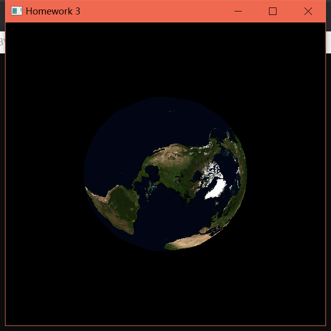
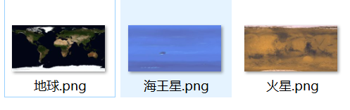
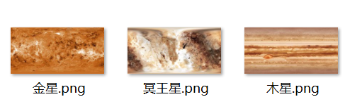
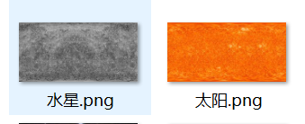
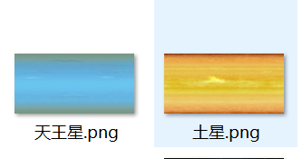
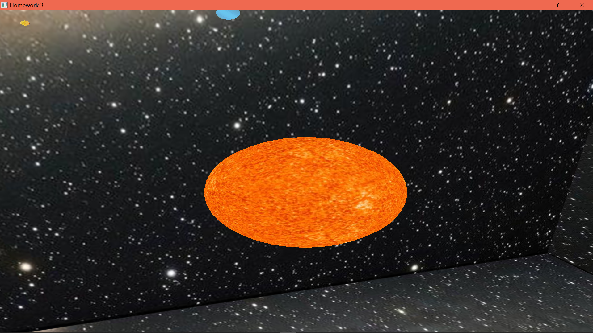
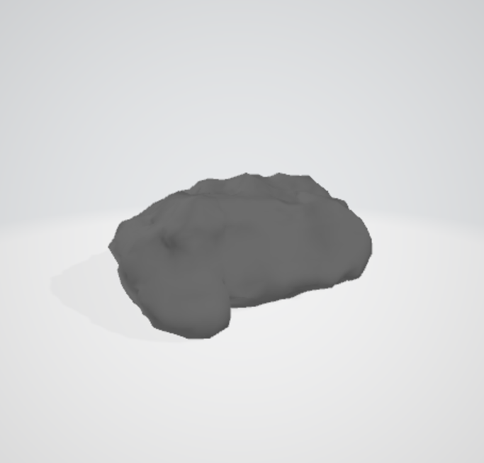
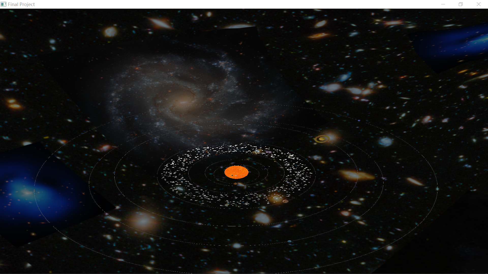
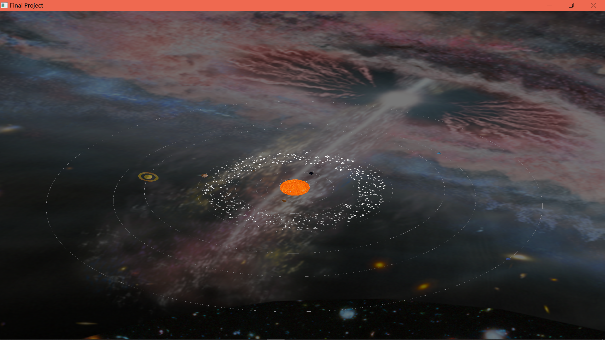
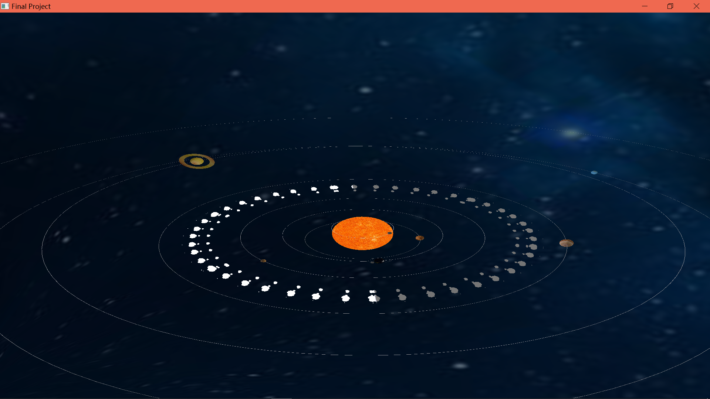

### 一、 项目主题
太阳系

### 二、 项目实现流程
下面是我本次大作业的实际实现过程：
1. 查找更方便的画球的 api (毕竟在作业 3 的时候，一开始的画球就把我难倒了)
2. 学习纹理相关方面的知识，实现在球面上贴图，搜集太阳系的行星图片，完成太阳系的行星贴图
3. 构造行星类，让太阳系内的行星围绕太阳旋转
4. 添加鼠标操作，键盘操作，即在场景中设置摄像机
5. 绘制天空盒
6. 绘制行星的轨迹
7. 绘制类地月系统
8. 绘制土星的光圈
9. 场景中设置光照
10. 绘制行星带和随机粒子
11. 绘制流星
### 三、 项目具体实现细节
接下来按照上面提到的过程具体叙述。

因为是 3d 场景，所以封装了 vec 类，主要是一些三维向量的计算，在这里不赘述。

#### 1. 画球
+ 主要参考博客: [用OpenGL绘制地球](https://blog.csdn.net/xoyojank/article/details/1434247)
  

由于作业3 的要求有讨论面的细分程度，所以当时觉得是需要自己定球的每个点坐标，但其实 opengl 有如 glPointer 方便绘制球的调用，但由于绘制完球之后需要贴上各个星球的纹理，所以最终找到了用二次曲面画球的 api：

```c++
GLUquadricObj *quadObj = gluNewQuadric();      //创建一个二次曲面物体
gluSphere(quadObj,1,20,20);                    //绘制一个球体
gluDeleteQuadric(quadObj);                     //删除二次曲面对象
```

#### 2. 贴图
+ 主要参考博客: [纹理](https://learnopengl-cn.github.io/01%20Getting%20started/06%20Textures/)、[OpenGL中曲面怎么进行纹理贴图](http://m.myexceptions.net/image/255550.html)、[LodePNG入门](https://blog.csdn.net/zerokkqq/article/details/52955866)、[OpenGL用不同参数调用glTexEnvf的效果实验](https://www.cnblogs.com/kekec/archive/2011/05/23/2054699.html)

纹理贴图首先要把图片文件读取进来，在这里使用 `loadpng` 代码(LodePNG是一个集合了PNG图像解码器和编码器的代码文件)，通过 `decode` 函数读入 png 图像文件:
```c++
unsigned decode(std::vector<unsigned char>& out, unsigned& w, unsigned& h,
                const std::string& filename,
                LodePNGColorType colortype = LCT_RGBA, unsigned bitdepth = 8);
```
可以通过该函数返回的错误码获，用 `lodepng_error_text` 函数获取错误信息:
```c++
lodepng_error_text(error)
```

读入 png 图像后，参照 OpenGL 官网教程，先创建纹理对象和绑定，然后用 glTexParameteri 设置纹理坐标超出范围的处理，用 glTexEnvf 设置材质和纹理的混合方式
```c++
	m_tex = 0;
	// 设置纹理空间并开启
	glEnable(GL_TEXTURE_2D);
	glPixelStorei(GL_UNPACK_ALIGNMENT, 1);

    // 创建纹理对象和绑定
	glGenTextures(1, &m_tex);
	glBindTexture(GL_TEXTURE_2D, m_tex);

	// 设置纹理属性
	glTexParameteri(GL_TEXTURE_2D, GL_TEXTURE_WRAP_S, GL_REPEAT);
	glTexParameteri(GL_TEXTURE_2D, GL_TEXTURE_WRAP_T, GL_REPEAT);
	glTexEnvf(GL_TEXTURE_ENV, GL_TEXTURE_ENV_MODE, GL_MODULATE);
	glTexParameteri(GL_TEXTURE_2D, GL_TEXTURE_MAG_FILTER, GL_LINEAR);
	glTexParameteri(GL_TEXTURE_2D, GL_TEXTURE_MIN_FILTER, GL_LINEAR);

```
最后根据纹理是否需要 mipmap 来加载原始纹理:
```c++
	if (make_mipmaps)
	{
		gluBuild2DMipmaps(GL_TEXTURE_2D, 4, width, height, GL_RGBA, GL_UNSIGNED_BYTE, &image[0]);
	}else{
		glTexImage2D(GL_TEXTURE_2D,
			0, 4, width,height,
			0, GL_RGB, GL_UNSIGNED_BYTE,pData);
    }

```
注意加载纹理的图像的大小最好是 2 的次幂，否则贴图会不成功，在实际中，对输入的图像，做了把图像长宽转换成最接近的 2 的次幂(OpenGL 支持的最大尺寸下)，然后对原始图像进行裁剪之后再加载纹理。

接下来就是绑定纹理坐标，因为是是用的二次曲面画的球，所以没有具体的点坐标，只用在画球之前建立纹理坐标，在绑定对应的纹理 ID 就可以贴上了:
```
glBindTexture(GL_TEXTURE_2D, ID);
gluQuadricTexture(quadObj, true);                 // 建立纹理坐标
glBindTexture(GL_TEXTURE_2D, 0);
```
注意，OpenGL 是状态机，绑定了纹理之后要解绑，否则接下来画的图元都是这个纹理。

如下图是成功绘制的地球:
<center>

</center> 

#### 3. 绘制太阳系
+ 图片来源: [美国国家航空航天局(nasa)](https://www.nasa.gov/)
一共有如下星球需要绘制:
<center>


</center>
<center>


</center>

为了方便，构建了一个星球类，该类有以下成员:
```c++
class Planet{
public:
  float revolution;       // 公转
  float addRevolution;    // 公转每天增加的角度
  float rotation;         // 自转
  float addRotation;      // 自转每天增加的角度
  float radius;           // 星球的半径
  float slope;            // 转轴倾斜角度
  
  vec3 pos;               //下面这个变量代表当前行星离父亲之间的的距离
 
  Texture *texture;       // 星球绑定的纹理类

  // 材质属性
  float ambient[4];
  float diffuse[4];
  float specular[4];
  float emission[4];
  float shininess;
public:
 
  Planet(const char* texname,float revolution,float rotation,float slope,float radius,vec3 pos);    // 初始化星球参数

  ~Planet();

};
```

然后搜集了各个星球的实际公转，自转速度，转轴倾斜角度，半径，距离太阳距离等，由于星球直接的这些差异实在太大，做了比例放缩之后，有些星球还是做了适当调整，最后各星球的初始化数据如下：
<center>
<table border="2">
<center>
    <tr align=middle>
        <td>星球</td>
        <td>半径</td>
        <td>公转增加的角度</td>
        <td>自转增加的角度</td>
        <td>自转倾斜角度</td>
        <td>距中心天体距离</td>
    </tr>
    <tr align=middle>
        <td>太阳</td>
        <td>1.0</td>
        <td>0.0</td>
        <td>0.1</td>
        <td>0.0</td>
        <td>0.0</td>
    </tr>
    <tr align=middle>
        <td>水星</td>
        <td>0.07</td>
        <td>2.09</td>
        <td>0.614</td>
        <td>0.034</td>
        <td>1.3</td>
    </tr>
    <tr align=middle>
        <td>金星</td>
        <td>0.142</td>
        <td>1.20</td>
        <td>0.233</td>
        <td>177.3</td>
        <td>1.885</td>
    </tr>
    <tr align=middle>
        <td>地球</td>
        <td>0.15</td>
        <td>0.5</td>
        <td>3.0</td>
        <td>23.4</td>
        <td>2.6</td>
    </tr>
    <tr align=middle>
        <td>月亮</td>
        <td>0.055</td>
        <td>3.1</td>
        <td>0.33</td>
        <td>6.68</td>
        <td>0.35</td>
    </tr>
    <tr align=middle>
        <td>火星</td>
        <td>0.123</td>
        <td>1.524</td>
        <td>20.1</td>
        <td>25.2</td>
        <td>3.952</td>
    </tr>
    <tr align=middle>
        <td>木星</td>
        <td>0.227</td>
        <td>0.389</td>
        <td>24.0</td>
        <td>3.1</td>
        <td>6.52</td>
    </tr>
    <tr align=middle>
        <td>土星</td>
        <td>0.2666</td>
        <td>0.334</td>
        <td>27.4</td>
        <td>26.7</td>
        <td>9.804</td>
    </tr>
    <tr align=middle>
        <td>天王星</td>
        <td>0.23</td>
        <td>0.311</td>
        <td>10.8</td>
        <td>97.8</td>
        <td>11.97</td>
    </tr>
    <tr align=middle>
        <td>海王星</td>
        <td>0.22</td>
        <td>0.186</td>
        <td>15.0</td>
        <td>28.3</td>
        <td>16</td>
    </tr>
    <tr align=middle>
        <td>冥王星</td>
        <td>0.32</td>
        <td>0.286</td>
        <td>6.0</td>
        <td>15.3</td>
        <td>20</td>
    </tr>
    </center>
</table>
</center>

星球的这部分旋转，再有了第二次作业绘制机器人的摆臂体验之后，这部分实现很简单，具体如下:
```c++
    // 绘制星球
    glPushMatrix();
	glRotatef(planet->revolution, 0.0f, 1.0f, 0.0f);	            // 公转
	glTranslatef(planet->pos.x, planet->pos.y, planet->pos.z);      // 公转半径or物体位置
	glRotatef(planet->slope, 0.0f, 0.0f, 1.0f);                     // 绕 z 轴倾斜，星球轴倾斜角
    glRotatef(planet->rotation, 0.0f, 1.0f, 0.0f);		            // 绕 x 轴自转
    planet->texture->BindTexture(planet->texture->m_tex);           // 绑定纹理
	drawSphere(planet->radius, 20, 20, true);                       // 绘制星球
    
    // SetMaterialDefault();                                        // 恢复场景材质属性
    planet->texture->BindTexture(0);                                // 取消绑定纹理
	glPopMatrix();    

    planet->revolution += planet->addRevolution;                    // 公转角度增加
    planet->rotation += planet->addRotation;                        // 自转角度增加
```
对于上面的代码，因为我是要先画一个球，然后让他绕 x 轴自转，为了让它公转的时候有个倾斜角，接着让它绕 z 轴旋转，旋转之后把它放在设置好的距离中心天体的位置，然后让他旋转，那么编程的话就要把这整个过程反过来，就有上面的矩阵变换操作函数。

#### 4. 添加鼠标操作，键盘操作
+ 主要参考博客: [摄像机](https://learnopengl-cn.github.io/01%20Getting%20started/09%20Camera/)

首先在继承 QWidget 类的 MyGLWidget 类中重定义该函数:
```c++
/*###################################################
##  函数: keyPressEvent
##  函数描述： 键盘控制视角
##  参数描述： 无
#####################################################*/
void MyGLWidget::keyPressEvent(QKeyEvent *e)
{
    float cameraSpeed = 0.2f;           // 摄像机移动速度

    if (e->key() == Qt::Key_W)
        camera.pos += camera.forward*cameraSpeed;
    if (e->key() == Qt::Key_S)
        camera.pos -= camera.forward*cameraSpeed;
    if (e->key() == Qt::Key_A)
        camera.pos -= camera.right *cameraSpeed;
    if (e->key() == Qt::Key_D)
        camera.pos +=camera.right *cameraSpeed;
    if (e->key() == Qt::Key_I)
        camera.processMouseMovement(0.0f, 5.0f);
    if (e->key() == Qt::Key_K)
        camera.processMouseMovement(0.0f, -5.0f);
    if (e->key() == Qt::Key_J)
        camera.processMouseMovement(-5.0f, 0.0f);
    if (e->key() == Qt::Key_L)
        camera.processMouseMovement(5.0f, 0.0f);
    if (e->key() == Qt::Key_O)
        lighting = !lighting;
    update();

/*###################################################
##  函数: mouseMoveEvent
##  函数描述： 鼠标控制视角移动
##  参数描述： 无
#####################################################*/
void MyGLWidget::mouseMoveEvent(QMouseEvent *e)
{
    float xpos = e->x();
    float ypos = e->y();
    if (firstMouse)
    {
        //捕获鼠标位置
        lastX = xpos;
        lastY = ypos;
        firstMouse = false;
    }
    //获取鼠标位移
    float xOffset = xpos - lastX;
    float yOffset = lastY - ypos;
    //更新鼠标位置
    lastX = xpos;
    lastY = ypos;
    //调用视角控制函数
    camera.processMouseMovement(xOffset, yOffset);
    update();
}
}
```
上面是 qt 监听鼠标和键盘操作相应函数，具体要做的就是当获取到用户输入某个键盘或者移动鼠标时对应要做出的改变，做出改变之后强制调用 `update` 重新绘制场景。在这里定义 **wsad** 分别是前后左右操作，**ikjl** 则是视角的上下左右微小移动，相当于鼠标，**o** 则是是否开启灯光效果。具体的改变这些操作则是在 camera 类实现：
```c++ 
camera = Camera(vec3(0.0f, 0.0f, 3.0f));

class Camera{
public :  
    vec3  pos;              //摄像机的世界空间坐标
    vec3  forward;          // 前后
    vec3  right;            // 左右
    vec3  up;               // 摄像机向上方向
    float pitch_speed;      //俯仰角变换速度
    float yaw_speed;        //偏航角移动速度
    float pitch, yaw;       //俯仰角，偏航角偏移角度

    Camera() {}
    Camera(vec3 at)
    {
      pos=at;
      pitch_speed = yaw_speed = 0.05f;
      pitch = 0.0f;
      yaw = 90.0f;
      forward = vec3(0.0f,0.0f,-1.0f);  // 前后偏移量
      right = vec3(1.0f,0.0f,0.0f);     // 左右偏移量
      up = vec3(0.0f,1.0f,0.0f);        // 向上方向
    }

    /*###################################################
    ##  函数: update
    ##  函数描述： MODELVIEW 设置
    ##  参数描述： 无
    #####################################################*/
    void update();

    /*###################################################
    ##  函数: ProcessMouseMovement
    ##  函数描述： 控制摄像机视角移动
    ##  参数描述： xOffset 水平方向移动距离
    ##           yOffset 垂直方向移动距离
    #####################################################*/
    void processMouseMovement(float xOffset, float yOffset);
    /*###################################################
    ##  函数: radian
    ##  函数描述： 角度转弧度
    ##  参数描述： angle 角度
    #####################################################*/
    float radian(const float angle)
    {
        return angle * 3.1415926535897626f / 180.0f;
    }
        
    };
};
```
如上代码，在初始化的时候，先将摄像机放在 (0.0f, 0.0f, 3.0f) 的位置，因为太阳在(0.0f,0.0f,0.0f),所以就把摄像机往前挪了一些，然后初始化了前后左右偏移量：
```c++
    forward = vec3(0.0f,0.0f,-1.0f);  // 前后偏移量
    right = vec3(1.0f,0.0f,0.0f);     // 左右偏移量
```
例如每一次向左移动的时候，是把当前摄像机的位置的 x 坐标减去 (right*摄像机移动的速度)，那么摄像机的 x 坐标就会有微小的向左移动，同理前后移动，**注意这里的向前移动是负数**，因为 z 轴是从屏幕指向外面。

camera 类的 `update` 函数主要是做 MODELVIEW 函数的设置：
```c++
void update()
{
    glMatrixMode(GL_MODELVIEW);
    glLoadIdentity();
    vec3 target = pos + forward;
    gluLookAt( 
      pos.x,pos.y,pos.z,                // 摄像机位置
      target.x,target.y,target.z,       // 摄像机观察的物体位置
      up.x,up.y,up.z                    // 摄像机向上方向
    );
}
```
其中 `target` 设置为让摄像机往前看就好了。

接下来是监听到鼠标事件的操作函数，将计算到的鼠标位移信息传给 `camera` 类的 `processMouseMovement` 函数，具体的实现，在阅读了 [learningopengl官网](https://learnopengl-cn.github.io/01%20Getting%20started/09%20Camera/) 关于欧拉角的介绍后，参考官网的实现:
```c++

/*###################################################
##  函数: ProcessMouseMovement
##  函数描述： 控制摄像机视角移动
##  参数描述： xOffset 水平方向移动距离
##           yOffset 垂直方向移动距离
#####################################################*/
void processMouseMovement(float xOffset, float yOffset)
{
    //计算视角偏移量
    xOffset *= yaw_speed;
    yOffset *= pitch_speed;
    //更新俯仰角，偏航角角度
    yaw += xOffset;
    pitch += yOffset;

    if (pitch > 89.0f) pitch = 89.0f;
    if (pitch < -89.0f) pitch = -89.0f;
    //更新摄像机坐标系
    vec3 tmp;
    tmp.x = std::cos(radian(yaw)) * std::cos(radian(pitch));
    tmp.y = std::sin(radian(pitch));
    tmp.z = std::sin(radian(yaw)) * std::cos(radian(pitch));
    forward = normalize(tmp);
    right = normalize(cross(forward, up));
    // up = normalize(cross(right, forward));

}
/*###################################################
##  函数: radian
##  函数描述： 角度转弧度
##  参数描述： angle 角度
#####################################################*/
float radian(const float angle)
{
    return angle * 3.1415926535897626f / 180.0f;
}
```

#### 5. 天空盒
+ 主要参考博客: [立方体贴图](https://learnopengl-cn.github.io/04%20Advanced%20OpenGL/06%20Cubemaps/)

天空盒即是绘制一个很大的立方体，然后把场景绘制在立方体内，给人一种被场景包围住的感觉。

在这一步的时候，因为已经有了会画立方体和纹理贴图的能力，所以还是比较简单实现的。封装了一个天空盒函数:

```c++
void drawSkyBox(Texture *tex,float x,float y,float z,float width,float height,float len){
    ·
    ·
    ·
    //获取中心点
    x=x-width/2;
    y=y-height/2;
    z=z-len/2;
    ·
    ·
    ·
}
```
通过调用函数时传递场景中心点坐标(在这里即是太阳的(0.0f,0.0f,0.0f)),然后根据要绘制的立方体的长宽高去计算中心点，然后以这个中心点为偏移给立方体天空盒定点，同时绑定纹理坐标。

如下图，是加了天空盒后的效果:
<center>

</center> 

但是有点问题，立方体的边界看的很明显，于是我把天空盒的立方体改成用球形，比绘制立方体天空盒方便多了，球形天空盒只是相当于我画的星球放大了很多，然后把星球画在了这个球里：
```c++
    // 球型天空盒
    glPushMatrix();
    boxtex->BindTexture(boxtex->m_tex);	
    glRotatef(sun->rotation,1.0f,1.0f,1.0f);        // 天空盒旋转
    gluSphere(quadObj,100.0f,20,20);
    boxtex->BindTexture(0);
    glPopMatrix();
```
这样球形就会没有像立方体这样的边界，然后为了让整个场景更加动态，我用了太阳的自转去旋转天空盒。

#### 6. 绘制轨迹
+ 主要参考博客: [<opengl>使用glu绘制二次曲面](https://www.cnblogs.com/foundkey/p/6024333.html)

除了 `gluSphere` 绘制球之外，还有 `gluDisk` 绘制圆环，这样绘制球的轨迹就只用在绘制球的时候，用 `gluDisk` 绘制一个圆环:
```c++
/*###################################################
##  函数: drawDisk
##  函数描述： 二次曲面圆盘绘制
##  参数描述：
##          innerRadius: 内环的半径
##          outerRadius: 外环的半径
##          slices: 细分程度
#####################################################*/
void MyGLWidget::drawDisk(GLdouble innerRadius, GLdouble outerRadius, GLint slices ){
  gluDisk(quadObj,innerRadius, outerRadius, slices, 1);     // 画圆盘
}

void MyGLWidget::drawPlanet(Planet* planet){
    // 绘制行星轨迹
	glPushMatrix();
    glTranslatef(0.0f,planet->pos.y,0.0f);
    glRotatef(90, 1.0f, 0.0f, 0.0f);
	drawDisk(planet->pos.x, planet->pos.x+0.01f, 100);
    glPopMatrix();
}
```
因为调用 `drawDisk` 函数默认将圆环绘制成垂直 xoz 平面，所以将它反转 90° 后设置平移到同行星一样的位置，然后内环和外环则是在行星的半径基础上设置。

#### 7. 绘制类地月系统
因为月球是环绕着地球转，而不是太阳，所以不能像绘制其他星球一样绘制月球，月球的绘制要在绘制完地球的基础上，在地球的偏移矩阵变换上，绘制月球，则月球就会绕地球旋转，所以另外写了一个绘制双星系统的函数:
```c++
/*###################################################
##  函数: DrawEarthAndMoon
##  函数描述： 绘制类地月的行星系统
##  参数描述：
##          p1: 中心天体
##          p2: 卫星
#####################################################*/
void MyGLWidget::DrawEarthAndMoon(Planet *p1, Planet *p2)
{    
    // SetMaterial(p1);                                  // 设置中心天体材质属性

    // 绘制中心天体轨迹
    glPushMatrix();
    glTranslatef(0.0f,p1->pos.y,0.0f);
    glRotatef(90, 1.0f, 0.0f, 0.0f);
	drawDisk(p1->pos.x, p1->pos.x+0.01f, 100);
    glPopMatrix();

    // 绘制中心天体
	glPushMatrix();     
	p1->texture->BindTexture(p1->texture->m_tex);           // 绑定中心天体纹理
	glRotatef(p1->revolution, 0.0f, 1.0f, 0.0f);            // 公转
	glTranslatef(p1->pos.x, p1->pos.y, p1->pos.z);          // 公转半径/物体位置
    glRotatef(p1->slope, 0.0f, 0.0f, 1.0f);                 // 绕 z 轴倾斜
	glRotatef(p1->rotation, 0.0f, 1.0f, 0.0f);              // 绕 x 轴自转 
	drawSphere(p1->radius, 20, 20, true);                   // 绘制星球
    
    // SetMaterialDefault();                                // 回复默认场景材质属性
    p1->texture->BindTexture(0);                            // 取消绑定纹理

    // SetMaterial(p2);                                     // 绑定卫星天体材质    

    // 绘制卫星轨迹       
    glPushMatrix();
    glTranslatef(0.0f,p2->pos.y,0.0f);              
    glRotatef(90, 1.0f, 0.0f, 0.0f);
	drawDisk(p2->pos.x, p2->pos.x+0.005f, 100);
    glPopMatrix();

    // 绘制卫星,在中心天体的矩阵上做变换
	glPushMatrix();
	p2->texture->BindTexture(p2->texture->m_tex);               // 绑定卫星纹理
	glRotatef(p2->revolution, 0.0f, 1.0f, 0.0f);                // 公转
	glTranslatef(p2->pos.x, p2->pos.y, p2->pos.z);              // 公转半径/物体位置
    glRotatef(p2->slope, 0.0f, 0.0f, 1.0f);                     // 绕 z 轴倾斜
	glRotatef(p2->rotation, 0.0f, 1.0f, 0.0f);                  // 绕 x 轴自转
	drawSphere(p2->radius, 20, 20, true);                       // 绘制球

    // SetMaterialDefault();                                    // 恢复默认场景属性
    p2->texture->BindTexture(0);                                // 取消绑定纹理
	glPopMatrix();
	glPopMatrix();

    p1->revolution += p1->addRevolution;                        // 中心天体公转角度增加
    p1->rotation += p1->addRotation;                            // 中心天体自转角度增加
    p2->revolution += p2->addRevolution;                        // 卫星公转角度增加
    p2->rotation += p2->addRotation;                            // 卫星自转角度增加
}
```
#### 8. 绘制星球光圈
这里的光圈同星球轨迹绘制的原理是一样的，只是把内环和外环的差距加大变粗，而轨迹是很细的，在这里绘制土星的光圈，绘制光圈用了土星的纹理:
```c++
    // 绘制星球
	glPushMatrix();
	p->texture->BindTexture(p->texture->m_tex);         // 绑定纹理
    glRotatef(p->revolution, 0.0f, 1.0f, 0.0f);         // 公转
	glTranslatef(p->pos.x, p->pos.y, p->pos.z);         // 公转半径or星球位置
    glRotatef(p->slope, 0.0f, 0.0f, 1.0f);              // 绕 z 轴倾斜
    // 光圈相对当前矩阵变换，push当前矩阵，绘制星球    
        glPushMatrix();
	    glRotatef(p->rotation, 0.0f, 1.0f, 0.0f);       // 绕 x 轴自转
	    drawSphere(p->radius, 20, 20, true);
        glPopMatrix();

    // 绘制光圈
	glPushMatrix();  
    glRotatef(90, 1.0f, 0.0f, 0.0f);
	drawDisk(0.5,0.7, 50);

    // SetMaterialDefault();                            // 恢复场景默认材质
    p->texture->BindTexture(0);                         // 取消绑定纹理
	glPopMatrix();
	glPopMatrix();
```
如上内环和外环差距是 0.2，而轨迹内外环差距是 0.01.

#### 9. 设置光照
+ 主要参考博客: [glLightfv, glLightModelfv](https://www.cnblogs.com/yyyyyyzh666/p/9916793.html)
  

在作业3中，我们是用 glsl 去自己计算关照的，但是 OpenGL 有一些现成的接口可以使用，首先设置光源的属性:
```
	float amb[4] = { 1.0f, 1.0f, 1.0f, 1.0f };      // 环境光
	float dif[4] = { 0.6f, 0.6f, 0.9f, 1.0f };      // 漫反射
    float spe[4] = { 0.7f, 0.7f, 0.8f, 1.0f };      // 镜面反射
	float pos[4] = { 0.0f, 0.0f, 0.0f, 1.0f };      // 光源位置
    float lightConstAttenuation[] = {1.0f};         // 常数衰减因子
    float lightLinearAttenuation[] = {0.1f};        // 线性衰减因子
    float lightQuadAttenuation[] = {0.0f};          // 平方衰减因子
    float LightModelAmbient[] = { 0.6f, 0.6f, 0.6f, 1.0 };      // 全局环境光的 RGBA 强度
```
在场景中，光源是太阳，所以位置在(0.0f,0.0f,0.0f),且是白光(1.0f,1.0f,1.0f)，衰减因子则是随着距离光源位置越远，得到的环境光越少。

```c++
	glLightfv(GL_LIGHT0, GL_AMBIENT, amb);
	glLightfv(GL_LIGHT0, GL_DIFFUSE, dif);
    glLightfv(GL_LIGHT0, GL_SPECULAR, spe);
	glLightfv(GL_LIGHT0, GL_POSITION, pos);
    glLightfv(GL_LIGHT0, GL_CONSTANT_ATTENUATION, lightConstAttenuation);
    glLightfv(GL_LIGHT0, GL_LINEAR_ATTENUATION, lightLinearAttenuation);
    glLightfv(GL_LIGHT0, GL_QUADRATIC_ATTENUATION, lightQuadAttenuation);
    glLightModelfv(GL_LIGHT_MODEL_AMBIENT, LightModelAmbient);
	glColorMaterial(GL_FRONT, GL_DIFFUSE);
```
然后将上面的数据设置到 `GL_LIGHT0`，最后因为 OpenGL 是状态机，所以要设置开启光照：
```
    // 开启光照
	if (lighting)
	{
		glEnable(GL_LIGHTING);
		glEnable(GL_LIGHT0);
        glEnable(GL_COLOR_MATERIAL);
	}
	else    // 关闭光照
	{
		glDisable(GL_LIGHTING);
		glDisable(GL_LIGHT0);
        glDisable(GL_COLOR_MATERIAL);
	}
```
注意在设置 `GL_LIGHT0` 的时候，设置了 `glColorMaterial(GL_FRONT, GL_DIFFUSE)` ，它的作用是踪当前颜色，即物体没有设置材质属性，但是会根据物体的法向量自动跟踪物体的光照效果。为了作出对比，最后的场景是希望，开启灯光的时候，太阳是发亮光，而其他星球或者物体是面向太阳的那一面才有光，背面则是暗的，所以需要在绘制图元的时候，设置物体材质，使用下面的函数设置物体材质:
```c++
/*###################################################
##  函数: SetMaterial
##  函数描述： 设置物体材质
##  参数描述：
##          p：星球类
#####################################################*/
void MyGLWidget::SetMaterial(Planet* p){
    glMaterialfv(GL_FRONT, GL_AMBIENT, p->ambient);
    glMaterialfv(GL_FRONT, GL_DIFFUSE, p->diffuse);
    glMaterialfv(GL_FRONT, GL_SPECULAR, p->specular);
    glMaterialfv(GL_FRONT, GL_EMISSION, p->emission);
    glMaterialf (GL_FRONT, GL_SHININESS,p->shininess);  
}
```
太阳的材质设置:
```c++
    // 设置星球的材质
	sun->ambient[0] = 1.0f,sun->ambient[1] = 1.0f,sun->ambient[2] = 1.0f,sun->ambient[3] = 1.0f;            // 材质属性中的环境光
    sun->diffuse[0] = 1.0f,sun->diffuse[1] = 1.0f,sun->diffuse[2] = 1.0f,sun->diffuse[3] = 1.0f;            // 材质属性中的散射光
    sun->specular[0] = 1.0f,sun->specular[1] = 1.0f,sun->specular[2] = 1.0f,sun->specular[3] = 1.0f;        // 材质属性中的镜面反射光
    sun->emission[0] = 1.0f,sun->emission[1] = 1.0f,sun->emission[2] = 1.0f,sun->emission[3] = 1.0f;        // 材质属性的镜面反射指数
    sun->shininess = 1.0f;
```
太阳的属性设置是全亮的，所以太阳会发亮光，而其他星球的同样可以像太阳这样设置(已在代码中实现)，不过最后的设置是其他星球用 `glColorMaterial` 跟踪。

要注意的是，**因为 OpenGL 是状态机**，所以设置了材质属性之后，不再做设置的话，后面画的所有物体都是这个材质属性，所以写了一个恢复默认的材质属性:
```c++
/*###################################################
##  函数: SetMaterialDefault
##  函数描述： 设置场景材质默认值
##  参数描述：无
#####################################################*/
void MyGLWidget::SetMaterialDefault(){
    float ambient[]   = {0.1f, 0.1f, 0.1f, 1.0f};
    float diffuse[]   = {0.3f, 0.3f, 0.3f, 1.0f};
    float specular[]  = {0.3f, 0.3f, 0.3f, 1.0f};
    float emission[]  = {0.3f, 0.3f, 0.3f, 1.0f};
    float shininess   = 0.0f;
    
    glMaterialfv(GL_FRONT, GL_AMBIENT, ambient);        // 材质属性中的环境光
    glMaterialfv(GL_FRONT, GL_DIFFUSE, diffuse);        // 材质属性中的散射光
    glMaterialfv(GL_FRONT, GL_SPECULAR, specular);      // 材质属性中的镜面反射光
    glMaterialfv(GL_FRONT, GL_EMISSION, emission);      // 材质属性中的发射光
    glMaterialf (GL_FRONT, GL_SHININESS,shininess);     // 材质属性的镜面反射指数
}
```
#### 10. 绘制行星带和随机粒子
+ 主要参考博客: [关于VBO的一些东西](http://blog.sina.com.cn/s/blog_7cfb366d010158he.html)

行星带的绘制首先是找了一个像石头的 obj 文件：
<center>

</center> 

然后用我在作业 2 封装的读入 obj 文件和绘制的类，可以直接使用来绘制，但是有个问题是，绘制行星带要绘制很多个，在实现的时候，绘制 100 个这样的石头就很卡(立即模式), 所以在绘制石头这一部分，使用 vbo & vao，同样的也是直接拿了我作业 3 的初始化 vbo 和 vao，但是要做一些改变，因为作业 3 的时候是结合了 shader，将顶点数据写入到缓冲区之后，顶点位置和顶点法向量都是用 `glVertexAttribPointer`，然后在 shader 中接收之后用内置变量设置，但是在这里不太需要用 shader，所以改用以下顶点属性设置:
```c++
/*###################################################
##  函数: initVboVao
##  函数描述： 初始化顶点缓冲区与顶点缓冲数组配置
##  参数描述：无
#####################################################*/
void MyGLWidget::initVboVao(){
	// 创建物体的 VAO

	//创建并绑定相应功能指针
	glGenVertexArrays(1, &vaoId);
	glGenBuffers(2, vboId);

	//绑定数组指针
	glBindVertexArray(vaoId);

    // 写入和设置顶点位置数据
	glBindBuffer(GL_ARRAY_BUFFER, vboId[0]);
	glBufferData(GL_ARRAY_BUFFER, sizeof(vertices), vertices, GL_STATIC_DRAW);
    glVertexPointer(3, GL_FLOAT, 6 * sizeof(GLfloat), (GLvoid*)0);
	glEnableClientState(GL_VERTEX_ARRAY);
    
    // 写入和设置顶点法向量数据
    glBindBuffer(GL_ARRAY_BUFFER, vboId[1]);
    glBufferData(GL_ARRAY_BUFFER, sizeof(vertices), vertices, GL_STATIC_DRAW);
    glNormalPointer(GL_FLOAT, 6 * sizeof(GLfloat), (GLvoid*)(3 * sizeof(GL_FLOAT)));
    glEnableClientState(GL_NORMAL_ARRAY);
    
    //设置顶点属性指针
	// glVertexAttribPointer(0, 3, GL_FLOAT, GL_FALSE, 6 * sizeof(GLfloat), (GLvoid*)0);
	// glEnableVertexAttribArray(0);

	// 设置法向量属性
	// glVertexAttribPointer(1, 3, GL_FLOAT, GL_FALSE, 6 * sizeof(GLfloat), (GLvoid*)(3 * sizeof(GL_FLOAT)));
	// glEnableVertexAttribArray(1);	

	//解绑VAO
	glBindVertexArray(0);

    // for(int i = 0; i < 10;i++){
    //     printf("%d ",vertices[i]);
    // }
}
```
即用 `glVertexPointer` 和 `glNormalPointer` 设置顶点属性，然后画的时候和之前的一样先绑定 vao，再用 `glDrawArrays`。

另外为了使行星带分布的随机和大小随机，以及其他粒子随意绕着太阳转，所以要固定随机生成这些粒子的属性:
```c++
float stoneArr[N][3];       // 行星带粒子的属性,存储内容：粒子位置(stoneArr[i][0] = x,stoneArr[i][1] = y,0)，粒子半径缩放 stoneArr[i][2] = s 
float randomParticle[M][6]; // 随机粒子属性，存储内容: 粒子位置(randomParticle[i][0] = x,randomParticle[i][1] = y,0)，粒子半径缩放 randomParticle[i][2] = s,粒子倾斜角 randomParticle[i][3] = slope,粒子旋转角度 randomParticle[i][4]，粒子旋转自增角度 randomParticle[i][5]

/*###################################################
##  函数: createStoneArr
##  函数描述： 随机生成行星带粒子属性和随机粒子属性
##  参数描述： 无
#####################################################*/
void MyGLWidget::createStoneArr(){
    // 行星带粒子属性
    for(int i = 0; i < N;i++){
        float r = 2.0 *(double)rand() / (double)RAND_MAX - 1.0;         // 范围为 [-1,1] 的随机数
        r += 5.2f;
        float x = r * cos(i);           // 圆坐标
        float y = r * sin(i);
        float s = rand()%10+1;
        stoneArr[i][0] = x;
        stoneArr[i][1] = y;
        stoneArr[i][2] = s;
    }

    // 随机粒子属性
    for(int i = 0; i < M; i++){
        float r = rand()%20 + 1;
        float x = r*cos(i);
        float y = r*sin(i);
        float s = rand()%10+1;
        float slope = rand()%180;
        float addRevolution = rand()%5+1;
        randomParticle[i][0] = x;
        randomParticle[i][1] = y;
        randomParticle[i][2] = s;
        randomParticle[i][3] = slope;
        randomParticle[i][4] = 0.0f;
        randomParticle[i][5] = addRevolution;
    }

}
```
每次固定生成粒子属性之后，然后用 `glDrawArrays` 绘制。

#### 11. 绘制流星
原本是想用顶点实现拖拽的效果，但是时间有限也觉得有点麻烦，最后的方法是是用绘制星球的办法，一次在一个位置的周围随机绘制很多个小星球，实现重影效果:
```c++
/*###################################################
##  函数: drawParticle
##  函数描述： 绘制流行粒子
##  参数描述：
##          p: 星球类
#####################################################*/
void MyGLWidget::drawParticle(Planet* p) {
    SetMaterial(p);             // 设置流行粒子材质
    // 绘制多个星球实现重影效果
    for(int i = 0; i < 50;i++){
        float r = 2.0 * (double)rand() / (double)RAND_MAX - 1.0;
        r = r/10;
        glPushMatrix();
        glRotatef(90,0.0f,0.0f,1.0f);                           // 绕太阳 x 轴旋转
        glRotatef(p->revolution, 0.0f, 1.0f, 0.0f);	            // 公转
        glTranslatef(p->pos.x+r, p->pos.y+r, p->pos.z+r);       // 公转半径/物体位置
        glRotatef(p->slope, 0.0f, 0.0f, 1.0f);                  // 绕 z 轴倾斜
        // glRotatef(p->rotation, 0.0f, 1.0f, 0.0f);		    // 绕 x 轴自转
        p->texture->BindTexture(p->texture->m_tex);             // 绑定纹理
        drawSphere(p->radius+r, 20, 20, true);                  // 绘制球
        p->texture->BindTexture(0);                             // 取消绑定纹理
        glPopMatrix(); 
    }
   
    SetMaterialDefault();                                       // 恢复场景材质
    
    p->revolution += p->addRevolution;                          // 公转角度增加
}
```
### 四、 项目成果展示
以下是最后的效果截图:
<center>

</center> 

<center>

</center> 

**在附件中附有视频**

### 五、 总结和心得感想
+ 遇到的困难和解决方法
1. 贴图贴了一晚上没贴上，很多博客都是说开启纹理坐标就能贴，但这也挺疑惑的，因为看的纹理贴图博客都是要先绑定坐标。最后发现没贴上的原因是，我在 vs code 打代码，然后在 vs 编译，然后因为编码模式不匹配(我的vs code 是 utf-8，vs 是 GBK)，文件名传过去的时候乱码了……

2. 贴图成功之后，项目就有了很大的进展，然后在摄像机又卡住了些，主要是一开始没有理解到前后左右移动的偏移量，初始化有误。

3. **OpenGL 是个状态机！** 有时候觉得 OpenGL 是个状态机挺方便的，有时候又感觉挺麻烦，例如在绑定纹理，设置物体材质，设置物体颜色之后，明明只想对那个物体设置，却又把整个场景都搞砸了。
   
4. 使用 vbo 和 vao 的时候，直接用作业 3 的代码，但是把初始化调用函数放在了构造函数中执行，然后报了内存访问冲突的变化，感到很疑惑，因为这是作业 3 可以跑通的代码，怎么在这就不行了，找了很多方法，最后无意间把初始化放在了 MyGLWidget 类的初始化函数，然后就可以了，虽然现在还是不太明白为什么，不过这个问题没有解决差点就画不了行星带了。 
   
5. 画行星带的时候，一开始石头的位置是固定的，且因为没有用 shader，而我还是用 `glVertexAttribPointer` 设置顶点属性，所以在绘制的时候会失去法向量的信息,最后会有如下奇怪的效果:

<center>

</center> 

而不用 `glVertexAttribPointer`，用 `glVertexPointer` 和 `glNormalPointer`，很少博客提及这两个函数结合 vbo 和 vao 的使用，最后试了很多种绑定和组合方法之后，终于成功了，不然行星带又没得画了。实现了之后就发现绑定很简单，就是传递两次顶点数据到缓冲区，然后设置顶点属性:
```c++
    // 写入和设置顶点位置数据
	glBindBuffer(GL_ARRAY_BUFFER, vboId[0]);
	glBufferData(GL_ARRAY_BUFFER, sizeof(vertices), vertices, GL_STATIC_DRAW);
    glVertexPointer(3, GL_FLOAT, 6 * sizeof(GLfloat), (GLvoid*)0);
	glEnableClientState(GL_VERTEX_ARRAY);
    
    // 写入和设置顶点法向量数据
    glBindBuffer(GL_ARRAY_BUFFER, vboId[1]);
    glBufferData(GL_ARRAY_BUFFER, sizeof(vertices), vertices, GL_STATIC_DRAW);
    glNormalPointer(GL_FLOAT, 6 * sizeof(GLfloat), (GLvoid*)(3 * sizeof(GL_FLOAT)));
    glEnableClientState(GL_NORMAL_ARRAY);
```

+ 项目不足之处
  

虽然离心目中的宇宙还是有些差距，但是再加了行星带之后对目前的效果还算满意，流星有点不太如意，也许应该增大每次绘制的小星球的间隔，现在的效果是重影太少了。另外也可以实现一些粒子碰撞爆炸效果，太阳活动小爆炸，绘制彗星等等……总之还有很多可以完善的元素。

+ 实验总结

在作业 3 的时候，感觉画个球对我来说都是很难的事，在这次作业中就觉得画球很简单了。以及对摄像头的设置一直是很害怕的，初入门的时候好容易就迷失在场景中(找不到我画的东西了)，在认认真真看了官网教程之后，包括绘制天空盒的，以及对于 vbo 和 vao 的编程又更进一步的掌握，最后能在本课程中绘制自己喜欢的东西是一次很不错的收获。

### 六、 参考资料
1. [用OpenGL绘制地球](https://blog.csdn.net/xoyojank/article/details/1434247)
2. [纹理](https://learnopengl-cn.github.io/01%20Getting%20started/06%20Textures/)
3. [OpenGL中曲面怎么进行纹理贴图](http://m.myexceptions.net/image/255550.html)
4. [LodePNG入门](https://blog.csdn.net/zerokkqq/article/details/52955866)
5. [OpenGL用不同参数调用glTexEnvf的效果实验](https://www.cnblogs.com/kekec/archive/2011/05/23/2054699.html)
6. [摄像机](https://learnopengl-cn.github.io/01%20Getting%20started/09%20Camera/)
7. [立方体贴图](https://learnopengl-cn.github.io/04%20Advanced%20OpenGL/06%20Cubemaps/)
8. [glLightfv, glLightModelfv](https://www.cnblogs.com/yyyyyyzh666/p/9916793.html)
9. [关于VBO的一些东西](http://blog.sina.com.cn/s/blog_7cfb366d010158he.html)

